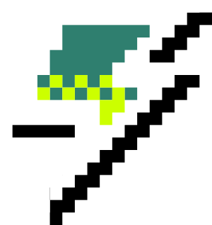

# Capítulo II: Requirements Elicitation & Analysis
## 2.1. Competidores
### 2.1.1. Análisis competitivo
<table>
  <tr>
    <th colspan="22">Competitive Analysis Landscape</th>
  </tr>
  <tr>
    <td colspan="1">¿Por qué llevar a cabo el análisis?</td>
    <td colspan="17">El análisis competitivo es esencial para entender el mercado, identificar oportunidades de diferenciación y anticipar amenazas. Permite ajustar la estrategia para ganar ventaja sobre la competencia y asegurar el éxito del producto.</td>
  </tr>
  <tr>
    <td colspan="2"></td>
    <td>Vortex </td>
    <td>Steam </td>
    <td>Itch.io </td>
    <td>Game Jolt </td>
  </tr>
  <tr>
    <td rowspan="2">Perfil</td>
    <td>Overview</td>
    <td>Vortex es una plataforma emergente que conecta a los jugadores con juegos que coinciden con sus intereses, ofreciendo recomendaciones personalizadas, funciones sociales, y un espacio para desarrolladores para promocionar sus títulos a una audiencia apasionada.</td>
    <td>Steam es una plataforma de distribución de videojuegos que ofrece una extensa biblioteca de juegos, junto con características sociales, reseñas y contenido generado por los usuarios.</td>
    <td>Itch.io es una plataforma para juegos indie que permite a los desarrolladores vender y promocionar sus juegos directamente a los usuarios, ofreciendo opciones de precios flexibles.</td>
    <td>Game Jolt es una plataforma que permite a los desarrolladores indie compartir sus juegos gratuitamente o de pago, con una comunidad activa que incluye características sociales y de descubrimiento.</td>
  </tr>
  <tr>
  <td>Ventaja competitiva ¿Qué valor ofrece a los clientes?</td>
    <td>Recomendaciones personalizadas, enfoque en el descubrimiento de juegos, herramientas sociales integradas, y opciones avanzadas mediante suscripción que mejoran la experiencia de los usuarios y desarrolladores.</td>
    <td>Biblioteca masiva, comunidad global, compatibilidad con mods, y ventas regulares que atraen a una gran audiencia.</td>
    <td>Plataforma amigable para los desarrolladores independientes con control total sobre el precio y el contenido.</td>
    <td>Enfoque en juegos indie con una fuerte comunidad social, permite a los desarrolladores interactuar directamente con los jugadores.</td>
  </tr>
  <tr>
    <td rowspan="2">Perfil de Marketing</td>
    <td>Mercado Objetivo</td>
    <td>Jugadores que desean descubrir nuevos juegos que se alineen con sus gustos y desarrolladores que buscan llegar a audiencias específicas y apasionadas.</td>
    <td>Jugadores de PC que buscan una gran variedad de títulos, desde triple-A hasta indie, con características sociales y ofertas.</td>
    <td>Desarrolladores indie y jugadores interesados en títulos alternativos y experimentales.</td>
    <td>Desarrolladores indie y gamers que disfrutan de juegos experimentales y que buscan una comunidad social activa.</td>
  </tr>
  <tr>
  <td>Estrategias de Marketing</td>
    <td>Publicidad en línea, redes sociales, colaboraciones con desarrolladores, y contenido generado por los usuarios para promover el descubrimiento.</td>
    <td>Descuentos importantes, publicidad en medios, colaboraciones con desarrolladores.</td>
    <td>Estrategia centrada en la comunidad, marketing orgánico y promociones internas.</td>
    <td>Promoción a través de eventos comunitarios, contenido generado por los usuarios y campañas sociales.</td>
  </tr>
  <tr>
    <td rowspan="3">Perfil de Producto</td>
    <td>Productos y Servicios</td>
    <td>Plataforma de descubrimiento de juegos con recomendaciones personalizadas, funciones sociales avanzadas, y herramientas para que los desarrolladores promocionen sus juegos directamente a los jugadores.</td>
    <td>Venta de juegos digitales, contenido generado por usuarios, soporte para mods, reseñas, y más.</td>
    <td>Venta directa de juegos indie, herramientas de promoción y precios flexibles.</td>
    <td>Comunidad activa que promueve juegos indie con herramientas para desarrolladores.</td>
  </tr>
  <tr>
  <td>Precios y Costos</td>
    <td>Suscripción mensual para características avanzadas, con acceso gratuito a las funciones básicas.</td>
    <td>Los precios varían según el juego; acceso gratuito a la plataforma.</td>
    <td>Los desarrolladores establecen los precios, algunos juegos son gratuitos.</td>
    <td>Juegos gratuitos o de pago; sin costo para unirse a la comunidad.</td>
  </tr>
  <td>Canales de distribución (Web y/o Móvil)</td>
    <td>Web, cliente de escritorio (en desarrollo).</td>
    <td>Web, cliente de escritorio, aplicación móvil.</td>
    <td>Web, cliente de escritorio.</td>
    <td>Web, cliente de escritorio, móvil.</td>
  <tr>
    <td rowspan="4">Análisis SWOT</td>
    <td>Fortalezas</td>
    <td>Enfoque en recomendaciones personalizadas, funciones sociales mejoradas, relación cercana con desarrolladores indie.</td>
    <td>Base de usuarios masiva, excelente infraestructura, gran biblioteca de juegos.</td>
    <td>Comunidad fuerte, flexibilidad en precios y distribución.</td>
    <td>Comunidad activa, soporte para desarrolladores indie, interacción directa entre jugadores y creadores.</td>
  </tr>
  <tr>
  <td>Debilidades</td>
    <td>Plataforma en etapa de crecimiento, con menos historial en comparación con competidores establecidos.</td>
    <td>Competencia feroz, saturación de contenido, dependencia de ventas masivas.</td>
    <td>Alcance limitado fuera del ámbito indie, dependencia de la comunidad para el crecimiento.</td>
    <td>Enfoque casi exclusivo en juegos indie, con menos exposición masiva.</td>
    </tr>
  <tr>
  <td>Oportunidades</td>
    <td>Crecimiento en mercados emergentes, asociaciones con desarrolladores y publishers para promover el descubrimiento.</td>
    <td>Expansión a mercados móviles, mayor integración de realidad virtual.</td>
    <td>Expansión a más géneros y categorías, colaboraciones con desarrolladores.</td>
    <td>Potencial de monetización a través de nuevas características sociales y eventos comunitarios.</td>
  </tr>
  <tr>
  <td>Amenazas</td>
    <td>Competencia de grandes plataformas como Steam y Epic Games, que tienen mayor alcance y recursos.</td>
    <td>Nuevas plataformas de distribución que ofrecen menores comisiones.</td>
    <td>Falta de atención de grandes publishers, saturación del mercado indie.</td>
    <td>Desafíos para diferenciarse en un mercado competitivo dominado por grandes plataformas.</td>
  </tr>
</table>

### 2.1.2. Estrategias y tácticas frente a competidores
## 2.2. Entrevistas
### 2.2.1. Diseño de entrevistas
### 2.2.2. Registro de entrevistas
### 2.2.3. Análisis de entrevistas
## 2.3. Need finding

### 2.3.1. User Personas
En esta sección, presentaremos el perfil de nuestros User Persona, resultado de un análisis exhaustivo de las entrevistas realizadas con usuarios potenciales y una evaluación detallada de la competencia en el mercado. Los artefactos que se presentarán a continuación están estrechamente vinculados con las características clave identificadas durante este proceso, reflejando las necesidades, deseos y frustraciones más relevantes de nuestros usuarios objetivo.

A partir de las entrevistas, hemos extraído información valiosa que nos ha permitido definir con precisión y realismo a nuestros User Persona. Estos perfiles son esenciales para diseñar una plataforma que no solo cumpla con las expectativas de nuestros usuarios, sino que también optimice su experiencia en Vortex, maximizando la satisfacción tanto de los gamers como de las empresas desarrolladoras que buscan promover sus títulos en un entorno digital más eficiente.

- ** Segmento Objetivo: Gamers Entusiastas**

  

### 2.3.2. User Task Matrix
### 2.3.3. User Journey Mapping
### 2.3.4. Empathy Mapping
### 2.3.5. As-is Scenario Mapping
## 2.4. Ubiquitous Language
El "Lenguaje Ubicuo" de Vortex permitirá establecer un vocabulario común entre el equipo de desarrollo y los usuarios, facilitando la comprensión y comunicación de los conceptos clave relacionados con la recomendación de videojuegos y la interacción social dentro de la plataforma.

- **Videojuego:** Producto de entretenimiento digital que puede ser recomendado, agregado a una lista de favoritos, o subido por un desarrollador a la plataforma Vortex.

- **Desarrollador:** Usuario de Vortex que crea y publica videojuegos en la plataforma. Los desarrolladores pueden gestionar los videojuegos que suben, interactuar con otros desarrolladores y jugadores, y obtener métricas de popularidad.

- **Jugador:** Usuario de Vortex que utiliza la plataforma para recibir recomendaciones personalizadas de videojuegos, agregar amigos, ver los videojuegos que sus amigos juegan y agregar títulos a su lista de favoritos.

- **Recomendación de Videojuegos:** Funcionalidad de Vortex que sugiere videojuegos a los jugadores, basándose en sus preferencias personales, historial de juegos, y las recomendaciones relacionadas con los gustos de sus amigos.

- **Lista de Favoritos:** Colección personalizada de videojuegos que un jugador marca como favoritos, permitiendo un acceso rápido y fácil a los títulos que le interesan o que desea recordar.

- **Amigo:** Otro usuario de Vortex con el cual un jugador ha establecido una conexión dentro de la plataforma. Los amigos pueden compartir sus listas de juegos, ver las recomendaciones entre sí y mantenerse al día sobre sus actividades relacionadas con videojuegos.

- **Perfil de Jugador:** Información relacionada con un jugador en Vortex, que incluye su historial de juegos, preferencias, lista de amigos, y lista de videojuegos favoritos. El perfil también permite personalizar las recomendaciones que recibe.

- **Publicar Videojuego:** Acción disponible para los desarrolladores, que les permite subir sus videojuegos a la plataforma Vortex, haciéndolos accesibles para los jugadores y ofreciendo la posibilidad de recibir recomendaciones a otros usuarios.

- **Métricas de Videojuegos:** Herramienta que proporciona a los desarrolladores estadísticas sobre el rendimiento de sus videojuegos en Vortex, como la cantidad de jugadores, calificaciones y popularidad dentro de la plataforma.

- **Plan para Desarrolladores:** Nivel de suscripción que permite a los desarrolladores subir videojuegos a la plataforma, administrar su contenido, y acceder a métricas avanzadas de desempeño.

- **Plan para Jugadores:** Nivel de suscripción que ofrece a los jugadores la posibilidad de agregar amigos, recibir recomendaciones de videojuegos, crear listas de favoritos, y disfrutar de una experiencia personalizada basada en sus gustos y los de sus amigos.

- **Algoritmo de Recomendación:** Motor detrás de Vortex que analiza los gustos de los jugadores y sus amigos para generar recomendaciones de videojuegos. Este algoritmo se ajusta según las interacciones del jugador en la plataforma.
 

- **Juego Relacionado:** Videojuego que el sistema de Vortex sugiere a un jugador, basado en los videojuegos que ha jugado previamente o que se encuentran en la lista de favoritos de sus amigos.
 

- **Reseña de Videojuego:** Opinión escrita por un jugador sobre un videojuego, que puede ser visible para otros jugadores de la plataforma y ayudar a influir en las recomendaciones y decisiones de compra.
