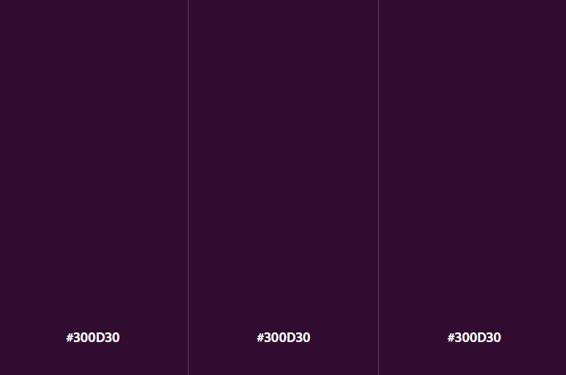
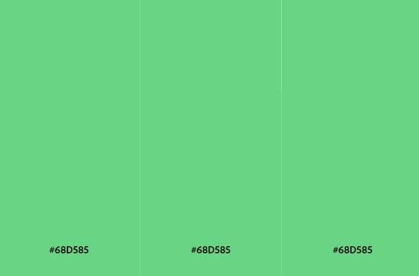
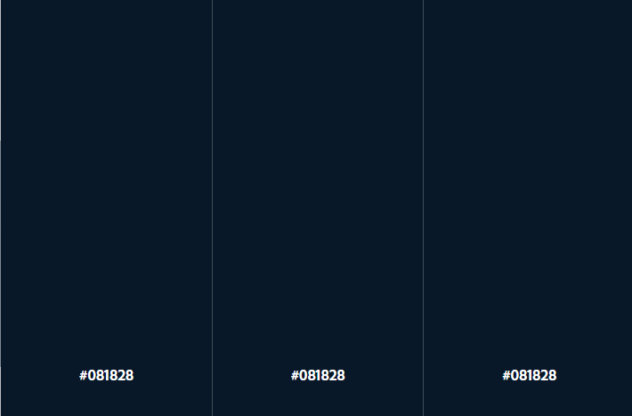
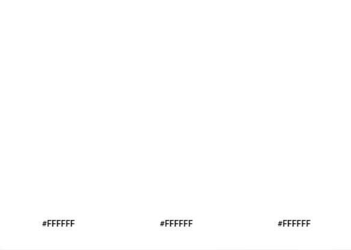
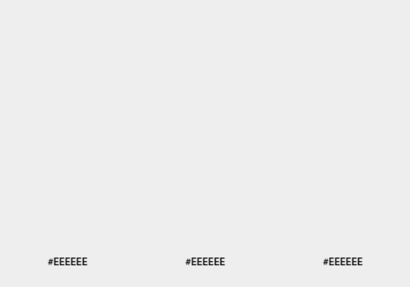
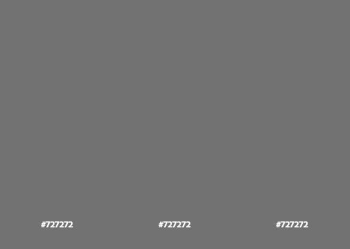
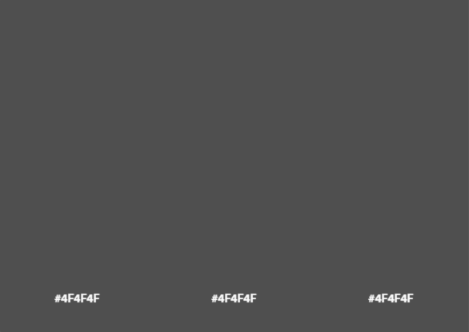
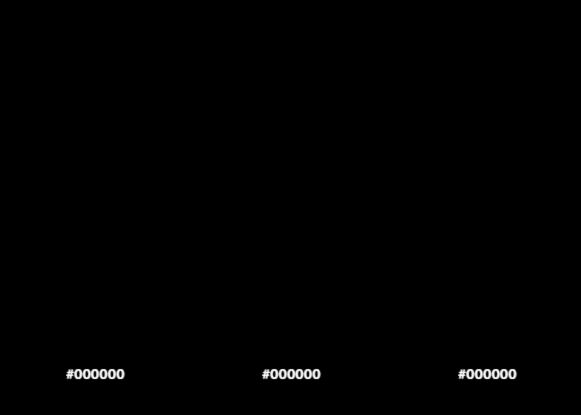
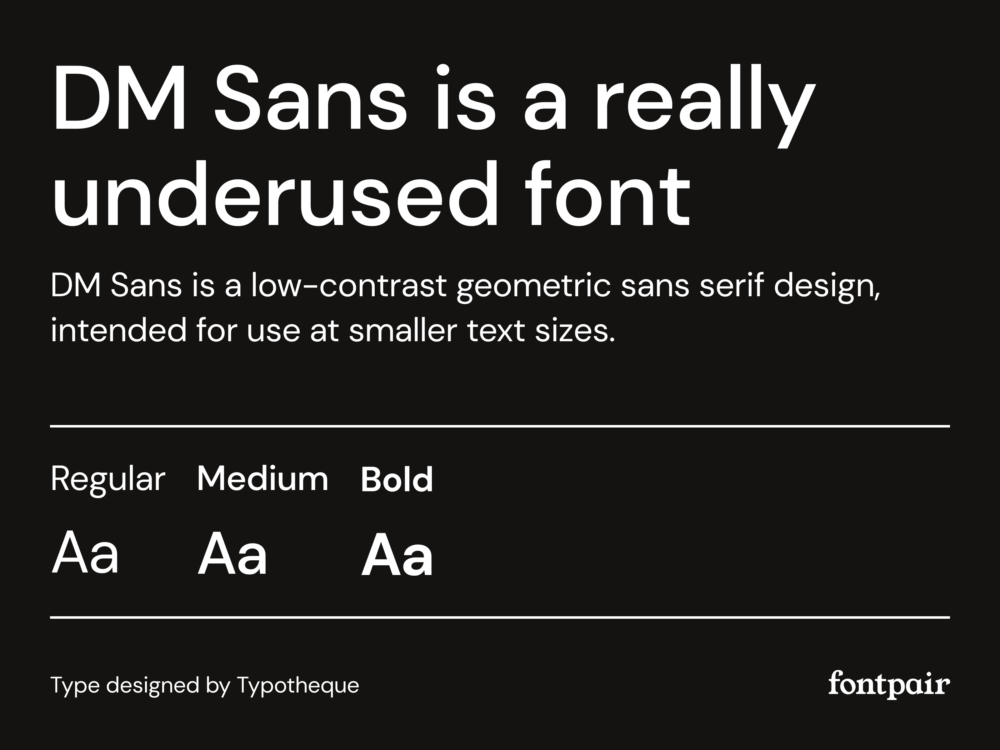
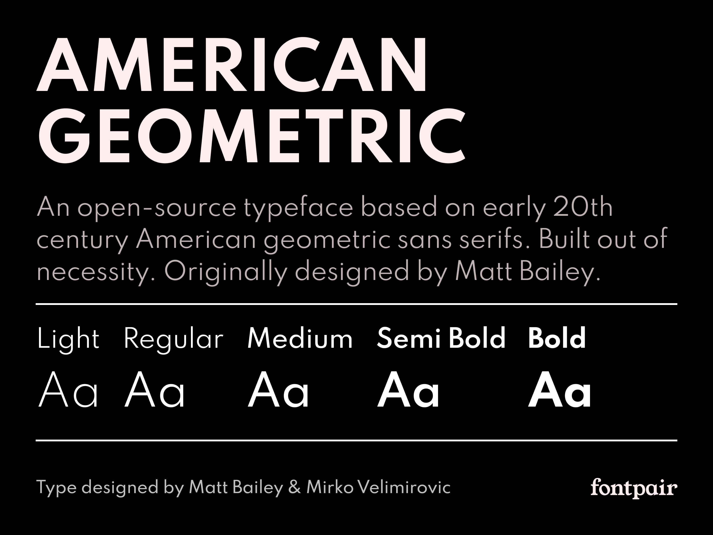

# **CAPÍTULO IV: PRODUCT DESIGN**
## 4.1. Style Guidelines
En esta sección, presentaremos el concepto de diseño para la plataforma web, para proporcionar a nuestros usuarios una interfaz amigable y funcional. Con este propósito en mente, hemos optado por utilizar elementos visuales que sean fáciles de percibir y que resulten atractivos a la vista.

### 4.1.1. General Style Guidelines
La paleta de colores seleccionada para la plataforma se ha diseñado con el objetivo de lograr un equilibrio visual que transmita modernidad, profesionalismo y claridad en la interfaz. Se utiliza una combinación de colores cromáticos y acromáticos para establecer una jerarquía visual coherente, enfocada en mejorar la experiencia del usuario y la legibilidad.

**Chromatic Colors:**

#300D30 (Violeta Oscuro): Este tono profundo y elegante se utiliza para destacar elementos clave, como botones importantes o encabezados, proporcionando un contraste visual que guía la atención del usuario de manera efectiva.

  

#68D585 (Verde Serenidad): Este verde suave y sereno se utiliza para ciertos íconos, aportando una sensación de equilibrio y sutileza. Es un tono que complementa la paleta principal, ayudando a guiar visualmente al usuario sin distraer.

  

#081828 (Azul Profundo - Secundario): Este color azul oscuro se emplea como color secundario en botones, el pie de página y otros elementos visuales. Representa la estabilidad y la confianza, ofreciendo un contraste sólido y profesional frente a los tonos verdes más brillantes de la paleta.

  

**Achromatic Colors:**

#FFFFFF (Blanco Puro): El blanco es fundamental para los espacios en blanco y como color de fondo principal. Representa la pureza y la claridad, asegurando que el contenido sea fácilmente legible y que la interfaz se sienta abierta y acogedora.

  

#EEEEEE (Gris Suave): Un gris muy claro que se emplea en fondos y separadores. Ofrece una base limpia y ligera, perfecta para mantener una apariencia fresca y ordenada en la interfaz.

  

#727272 (Gris Equilibrio): Este tono de gris medio se utiliza para elementos secundarios y textos que requieren un enfoque sutil. Representa el equilibrio y la neutralidad, aportando un contraste suave sin dominar la atención visual.

  

#4F4F4F (Gris Profundo): Este gris oscuro se utiliza para textos y elementos gráficos que requieren mayor peso visual, sin llegar a la intensidad del negro. Es un color que transmite seriedad y formalidad, ideal para secciones importantes del proyecto.

  

#000000 (Negro Absoluto): El negro se reserva para elementos que necesitan el máximo contraste y definición, como el texto principal y ciertos íconos. Representa la autoridad y la claridad, garantizando la máxima legibilidad y enfoque.

  

**Typography: Sans Serif**

La tipografía principal utilizada será DM Sans, seleccionada por su simplicidad, legibilidad y modernidad. Asegura una experiencia de lectura clara tanto en pantallas pequeñas como grandes, lo que la hace ideal para la interfaz de nuestra plataforma de videojuegos.

Este enfoque asegura que se respeten los principios de diseño modernos y que el estilo tipográfico sea consistente en toda la plataforma.

- **DM Sans - Sans Serif**

  

- **Spartan - Sans Serif**

  

**Icon:**

Nuestro logo está inspirado en el concepto de vortex, en línea con la temática espacial de la plataforma. Representa un remolino dinámico, evocando movimiento y descubrimiento. El color predominante del logo es el violeta, que es nuestro color principal y representativo, simbolizando creatividad y misterio, mientras mantiene una conexión visual con el espacio y la tecnología.

  
  

Este enfoque resalta la identidad visual del logo y su conexión con la temática del proyecto.

### 4.1.2. Web Style Guidelines
Las Web Style Guidelines de Vortex han sido desarrolladas con el objetivo de ofrecer una experiencia de usuario óptima y consistente en todos los dispositivos. Nuestra plataforma psiquiátrica está diseñada bajo los principios de Web Responsive Design, asegurando que cada elemento de la interfaz se ajuste fluidamente a diferentes tamaños de pantalla, desde dispositivos móviles hasta monitores de escritorio.

Uno de los enfoques clave en el diseño de nuestra interfaz es la implementación del patrón de diseño en forma de Z. Este patrón guía intuitivamente el ojo del usuario a través de la página, comenzando desde la esquina superior izquierda, pasando por el contenido central y terminando en la esquina inferior derecha. Este flujo natural facilita la navegación, permitiendo que los usuarios accedan rápidamente a la información más importante, como diagnósticos, citas y seguimientos de síntomas.

Nuestro diseño adaptable y el uso del patrón en Z garantizan que, independientemente del dispositivo utilizado, la experiencia de usuario sea fluida, intuitiva y centrada en las necesidades tanto de los médicos como de los pacientes. Estas directrices de estilo no solo definen la apariencia de Vortex, sino que también refuerzan nuestra misión de proporcionar un entorno digital accesible y eficaz para la gestión de la salud mental.

## 4.2. Information Architecture
### 4.2.1. Organization Systems 
### 4.2.2. Labeling Systems

### 4.2.3. SEO Tags and Meta Tags
En esta sección, abordaremos la implementación de SEO tags y meta tags para optimizar la visibilidad y el rendimiento de nuestra plataforma en los motores de búsqueda. Estas etiquetas son fundamentales para mejorar el posicionamiento de nuestro sitio web, asegurando que los usuarios puedan encontrar fácilmente nuestra plataforma y acceder a su contenido relevante. Exploraremos las mejores prácticas para la inclusión de estas etiquetas en nuestro HTML para maximizar el impacto en el SEO.

    <!DOCTYPE html>: Declara el tipo de documento y la versión de HTML.

    <html>: Elemento raíz del documento HTML. Contiene todos los demás elementos HTML.

    <head>: Contiene metadatos sobre el documento HTML, como el título, enlaces a hojas de estilo, y scripts.

    <meta charset="UTF-8">: Especifica la codificación de caracteres del documento.
    
    <title>: Define el título del documento, que aparece en la pestaña del navegador.
    
    <meta name="description" content="" />: Proporciona una descripción del contenido del documento para motores de búsqueda.
    
    <meta name="viewport" content="width=device-width, initial-scale=1" />: Configura la visualización del documento en dispositivos móviles.
    
    <link rel="shortcut icon" type="image/x-icon" href="assets/images/logo/vortex_icon.svg" />: Define el icono de la pestaña del navegador.
    
    <link rel="stylesheet" href="assets/css/bootstrap.min.css" />: Enlaza a una hoja de estilo CSS para el marco de trabajo Bootstrap.
    
    <link rel="stylesheet" href="assets/css/main.css" />: Enlaza a la hoja de estilo CSS principal.
    
    <link rel="stylesheet" href="assets/css/glightbox.min.css" />: Enlaza a una hoja de estilo CSS para GLightbox.
    
    <link rel="stylesheet" href="assets/css/LineIcons.3.0.css" />: Enlaza a una hoja de estilo CSS para los íconos de LineIcons.
    
    <link rel="stylesheet" href="assets/css/tiny-slider.css" />: Enlaza a una hoja de estilo CSS para Tiny Slider.
    
    <body>: Contiene el contenido visible del documento HTML.
    
    
: Contiene el diseño del preloader (pantalla de carga).
    
    <header class="header navbar-area">: Define la sección del encabezado del sitio, que incluye la barra de navegación.
    
    <nav class="navbar navbar-expand-lg">: Define la barra de navegación principal.
    
    <a class="navbar-brand" href="index.html">: Enlace al logotipo o nombre de la marca.
    
    <button class="navbar-toggler mobile-menu-btn": Botón para alternar el menú en dispositivos móviles.
    
    
: Contiene el menú de navegación desplegable.
    
    <ul id="nav" class="navbar-nav ms-auto">: Lista de elementos de navegación.
    
    <li class="nav-item">: Elemento de la lista de navegación.
    
    <a href="index.html" class="active">: Enlace de navegación para la página de inicio.
    
    <section class="hero-area">: Sección para el área principal de bienvenida (hero section).
    
    <h4> y <h1>: Encabezados de la sección principal.
    
    
: Párrafo de texto.
    
    
: Botón de llamada a la acción.

    
: Contenedor principal para el contenido de la sección.

    
: Título de la sección.

    <h3 class="wow zoomIn" data-wow-delay=".2s"> text here </h3>: Subtítulo que presenta la sección.

    <h2 class="wow fadeInUp" data-wow-delay=".4s"> text here </h2>: Título principal de la sección.

    
 text here 
: Descripción de la sección.

    <section id="aboutus" class="freatures section">: Sección para información sobre la empresa.
    
    
: Contiene características individuales.
    
    <i class="lni lni-dashboard"></i>: Icono de la característica.
    
    
: Sección de servicios ofrecidos.
    
    
: Servicio individual.
    
    <section id="pricing" class="pricing-table section">: Sección para las tablas de precios.
    
    
: Tabla de precios individual.
    
    <ul class="table-list">: Lista de características de la tabla de precios.
    
    <section class="intro-video-area section">: Sección dedicada al video introductorio.

    
: Contenedor principal para el contenido de la sección.

    
: Contiene el encabezado y el contenido principal de la sección.

    
: Contenedor para el área de reproducción del video.

    
: Contenedor para la miniatura de reproducción del video.

    <a src="https://www.youtube.com/embed/hvuojhm02Yk?si=Wu4NtzaLSxQ_w6wH" class="glightbox video"><i class="lni lni-play"></i></a>: Enlace para reproducir el video en YouTube.

    <section id="team" class="team section">: Sección dedicada al equipo.

    
: Contenedor para un miembro del equipo.

    
: Contenedor para la imagen del miembro del equipo.

    <section id="testimonial" class="testimonials style2 section">: Sección dedicada a los testimonios de clientes.
    
    
: Contenedor para el slider de testimonios.
    
    
: Columna que contiene un testimonio individual.
    
    
: Contenedor para un testimonio individual.
    
    
: Contenedor para el contenido interno del testimonio.
    
    
: Contenedor para el texto del testimonio.
     
    
: Contenedor para la información del autor del testimonio.

    
: Contenedor para el contenido interno del testimonio.

De la misma manera se consideran más secciones. Podemos identificar algunas etiquetas principales y que normalmente usamos en nuestra estructura HTML:

    <section class="hero-area">: Sección para el área principal de bienvenida (hero section).

    <h4> y <h1>: Encabezados de la sección principal.
    
    
: Párrafo de texto.
    
    
: Botón de llamada a la acción.

    
: Contenedor principal para el contenido de la sección.

    
: Título de la sección.

    <h3 class="wow zoomIn" data-wow-delay=".2s"> text here </h3>: Subtítulo que presenta la sección.

    <h2 class="wow fadeInUp" data-wow-delay=".4s"> text here </h2>: Título principal de la sección.

    
 text here 
: Descripción de la sección.

### 4.2.4. Searching Systems

## 4.3. Landing Page UI Design
En esta sección, detallaremos las mejores prácticas y los elementos de diseño que se han implementado para lograr una landing page efectiva y visualmente atractiva para Vortex.

### 4.3.1. Landing Page Wireframe
En esta sección, exploraremos el wireframe de la Landing Page para Vortex, que sirve como una guía para el desarrollo y diseño visual posterior. El wireframe incluye elementos clave como la ubicación del encabezado, la navegación, las secciones principales de contenido, las llamadas a la acción y el pie de página. Además, se identifican las áreas destinadas a destacar características importantes, testimonios, y opciones de suscripción.

El propósito de este wireframe es asegurar que la disposición de los elementos sea funcional y que cumpla con los objetivos del sitio web, facilitando una navegación intuitiva y una experiencia de usuario eficiente. La revisión y aprobación de este wireframe es un paso esencial antes de avanzar hacia el diseño detallado y la implementación final de la Landing Page.

- **Landing Page Wireframe para Desktop Web Browser**

  

Puedes acceder al contenido del Figma para landing page wireframe desktop web browser:

  

- **Landing Page Wireframe para Mobile Web Browser**

  

Puedes acceder al contenido del Figma para landing page wireframe mobile web browser:

  

### 4.3.2. Landing Page Mock-up
En esta sección, presentaremos el mock-up de la Landing Page para Vortex, reflejando cómo se integrarán los elementos visuales y el contenido definido en el wireframe. Este diseño detallado incluye la aplicación de la identidad visual de la marca, como el logotipo, esquemas de color, imágenes, iconografía y estilos tipográficos. También se incorporan los detalles interactivos, como botones, enlaces y formularios, para ofrecer una experiencia de usuario más completa y envolvente.

- **Landing Page Mock-up para Desktop Web Browser**

  
  

Puedes acceder al contenido del Figma para landing page mock-up desktop web browser:

  

- **Landing Page Mock-up para Mobile Web Browser**

  
  
  
  
  
  
  
  
  
  

Puedes acceder al contenido del Figma para landing page mock-up mobile web browser:

  

## 4.4. Web Applications UX/UI Design
### 4.4.1. Web Applications Wireframes
### 4.4.2. Web Applications Wireflow Diagrams
### 4.4.3. Web Applications Mock-ups
### 4.4.4. Web Applications User Flow Diagrams
## 4.5. Web Applications Prototyping
## 4.6. Domain-Driven Software Architecture
### 4.6.1. Software Architecture Context Diagram   
### 4.6.2. Software Architecture Container Diagrams
### 4.6.3. Software Architecture Components Diagrams
## 4.7. Software Object-Oriented Design
### 4.7.1. Class Diagrams
### 4.7.2. Class Dictionary
## 4.8. Database Design
### 4.8.1. Database Diagram