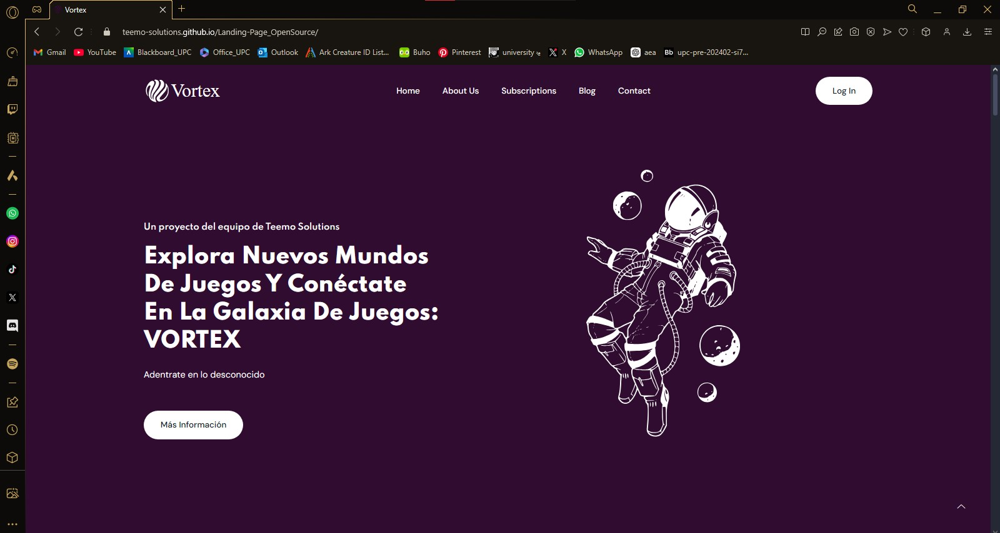
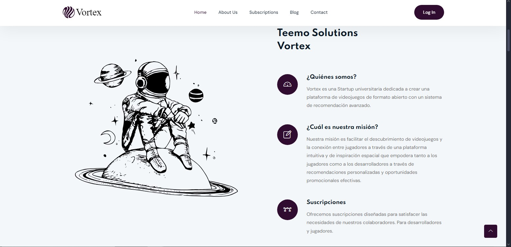
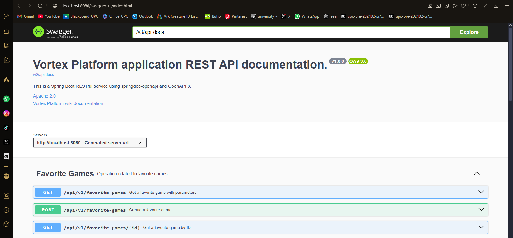

# **Capítulo V: Product Implementation, Validation & Deployment**
## 5.1. Software Configuration Management
### 5.1.1. Software Development Environment Configuration
En esta sección se describe las herramientas de software que utilizamos para colaborar en el ciclo de vida del proyecto de software.

**Project Management:**

- **Producto 1:** Whatsapp

  

- **Propósito:** Se utilizó WhatsApp como medio principal para la comunicación diaria entre los miembros del equipo. Su propósito fue facilitar el envío y recepción rápida de mensajes, coordinar actividades, y discutir avances o bloqueos en el desarrollo del proyecto, lo que optimizó la colaboración en tiempo real.
- **Ruta:** Este grupo es privado
- **Evidencia:**

  

---

- **Producto 2:** Discord

  

- **Propósito:** Se utilizó Discord para las reuniones y avances en tiempo real, aprovechando la funcionalidad de llamadas en canales de voz. Esto permitió una colaboración fluida, donde los miembros del equipo pudieron discutir y resolver problemas técnicos en tiempo real, optimizando la coordinación y el progreso del proyecto.
- **Ruta:** Este grupo es privado
- **Evidencia:**

  

---

- **Producto 3:** Trello

  

- **Propósito:** Se utilizó Trello para la asignación de tareas y el seguimiento del progreso de cada una. Esto facilitó la organización del trabajo del equipo, proporcionando una vista clara de las responsabilidades y el estado de cada tarea, lo que mejoró la planificación y la gestión del proyecto.
- **Ruta:** [Trello de Teemo Solutions](https://trello.com/invite/b/66e794edf4f9fedec2048599/ATTIfa1c3769a311557ffbe938d55599966c41049847/tb1-parcial)
- **Evidencia:**

  

**Requirement Management:**

- **Producto 1:** Miro

  

- **Propósito:** Se utilizó Miro para la elaboración de diagramas, permitiendo una colaboración visual en tiempo real entre los miembros del equipo.
- **Ruta:** [Miro de Teemo Solutions](https://miro.com/app/board/uXjVKYSGw5Y=/)
- **Evidencia:**

  

---

- **Producto 2:** UXPressia

  

- **Propósito:** Se utilizó UXPressia para la elaboración de mapas de empatía y user personas, permitiendo al equipo profundizar en la comprensión de las necesidades y comportamientos de los usuarios. Esta herramienta fue clave para definir los perfiles de usuario y crear experiencias más alineadas con sus expectativas y emociones.
- **Ruta:** Esta ruta no puede ser compartida a menos que se haya adquirido una suscripción.
- **Evidencia:**

  

---

- **Producto 3:** Structurizr

  

- **Propósito:** Se utilizó Structurizr para la creación de diagramas de componentes, contexto y contenedores. Esta herramienta ayudó al equipo a visualizar la arquitectura del sistema de manera clara y estructurada, facilitando la comprensión de cómo se interrelacionan los diferentes elementos del software y garantizando una planificación más eficiente.
- **Ruta:** [Structurizr de Teemo Solutions]()
- **Evidencia:**

  

**Product UX/UI Design:**

- **Producto 1:** Figma

  

- **Propósito:** Se utilizó Figma para la elaboración de wireframes y mockups, permitiendo la creación de prototipos visuales interactivos. Esta herramienta facilitó la colaboración en el diseño de la interfaz de usuario y ayudó al equipo a iterar rápidamente sobre diferentes ideas antes de pasar a la implementación.
- **Ruta:** [Figma de Teemo Solutions](https://www.figma.com/design/EYLzLCQ7Q0tj2w1ZfziK7D/TEEMO---FIGMA?node-id=0-1&t=iyhc8ybj8AX8zYjc-1)
- **Evidencia:**

  

---

- **Producto 2:** LucidChart

  

- **Propósito:** Se utilizó LucidChart para la creación de diagramas de clases y de base de datos, proporcionando una representación clara de la estructura del sistema. Esta herramienta facilitó la organización y planificación de la lógica de la aplicación, así como la estructura de almacenamiento de datos, asegurando que todos los elementos estuvieran correctamente interrelacionados.
- **Ruta:** [LucidChart de Teemo Solutions](https://lucid.app/lucidchart/5b93f4de-6135-4dcb-9f66-3f7f3fb2f005/edit?viewport_loc=-504%2C665%2C4992%2C2421%2C0_0&invitationId=inv_9f021ed4-6889-4f14-a487-05dd6b693eff")
- **Evidencia:**

  

**Software Development:**

- **Producto 1:** HTML

  

- **Propósito:** Se utilizó HTML como base para la estructura del contenido en el proyecto, permitiendo la creación de páginas web semánticas y accesibles. Esto facilitó la organización del contenido y garantizó que la interfaz de usuario estuviera bien estructurada, lo que contribuyó a una mejor experiencia de navegación

---

- **Producto 2:** CSS

  

- **Propósito:** Se utilizó CSS para el diseño y la presentación del proyecto, permitiendo la personalización del estilo visual y la responsividad de las páginas. Esto incluyó la definición de colores, tipografías, espaciados y animaciones, contribuyendo a una experiencia de usuario atractiva y coherente.

---

- **Producto 3:** JavaScript

  

- **Propósito:** Se utilizó JavaScript para añadir interactividad y funcionalidad dinámica al proyecto. Esto permitió la implementación de características como la validación de formularios, la manipulación del DOM y la gestión de eventos, mejorando la experiencia del usuario y la fluidez de la aplicación.

---

- **Producto 4:** WebStorm

  

- **Propósito:** Se utilizó WebStorm para la elaboración de la landing page, aprovechando sus características avanzadas de edición y herramientas integradas para facilitar el desarrollo. Esto permitió una gestión eficiente del código, la implementación de funcionalidades interactivas y la integración de estilos de manera organizada, contribuyendo a una presentación atractiva y profesional del proyecto.

---

- **Producto 5:** BootStrap

  

- **Propósito:** Se utilizó Bootstrap como framework CSS para agilizar el diseño y la maquetación de la landing page. Gracias a sus componentes y sistema de grid responsivo, se logró una interfaz coherente y adaptable a diferentes dispositivos, facilitando el desarrollo y asegurando una experiencia de usuario fluida.

---

- **Producto 6:** LineIcons

  

- **Propósito:** Se utilizó LineIcons para la incorporación de iconos en el diseño de la landing page. Esta biblioteca de iconos ligeros permitió enriquecer la interfaz visual, mejorando la comunicación de ideas y funciones a través de elementos gráficos claros y atractivos.

**Software Testing:**

- **Producto 1:** Lenguaje Gherkin

  

- **Propósito:** Se utilizó Gherkin como lenguaje de especificación para los testeos del proyecto, facilitando la redacción de pruebas de aceptación legibles y comprensibles tanto para desarrolladores como para partes interesadas no técnicas.

**Software Documentation:**

- **Producto 1:** GitHub

  

- **Propósito:** Se utilizó GitHub para el manejo del repositorio del proyecto, permitiendo un control de versiones efectivo y la colaboración entre los miembros del equipo. Esta plataforma facilitó el seguimiento de cambios, la gestión de ramas y la revisión de código, asegurando que el desarrollo se mantuviera organizado y documentado.
- **Ruta:** [GitHub de Teemo Solutions](https://github.com/Teemo-Solutions)

---

- **Producto 2:** Rider

  

- **Propósito:** Se utilizó Rider como entorno de desarrollo integrado (IDE) para el proyecto, proporcionando herramientas avanzadas para la edición de código, depuración y gestión de proyectos.

**Software Deployment:**

- **Producto 1:** GitHub Pages

  

- **Propósito:** Se utilizó GitHub Pages para el despliegue de la landing page, lo que permitió publicar la landing page de manera rápida y sencilla.
- **Ruta:** [Landing Page](https://teemo-solutions.github.io/Landing-Page_OpenSource/)

### 5.1.2. Source Code Management
- Landing Page Repository:

  

- **GitFlow Implementation:** Para implementar el flujo de trabajo Gitflow utilizando Git como nuestra herramienta de control de versiones, nos basamos en la entrada de blog "A successful Git branching model" de Vincent Driessen. Esta referencia nos permitió establecer las convenciones detalladas que serán aplicadas en nuestro proyecto

  

- **Master o Main branch:** La rama principal de desarrollo del proyecto es la Master branch. En esta rama reside el código que actualmente se encuentra en producción.

- **Develop branch:** La rama "Develop" albergará las más recientes actualizaciones y cambios agregados que serán incluidos en la próxima versión del proyecto. Esta rama sirve como un espacio para la integración y prueba continua de los cambios antes de ser fusionados con la rama principal "Master" para su despliegue en producción.

- **Release branch:** La rama de lanzamiento (Release branch) facilitará la preparación de una nueva versión del producto. Esta rama permitirá la corrección de errores y permitirá que la rama Develop reciba más actualizaciones.
 Debe derivarse de la rama Develop.
 Debe fusionarse con la rama Develop y Master.

- **Feature branch:** Las ramas de características (Feature branches) serán empleadas para desarrollar nuevas funcionalidades o características del producto que se agregarán en la siguiente versión o en versiones futuras. Estas funcionalidades deberán fusionarse eventualmente con la rama Develop.
 Debe derivarse de la rama Develop.
 Debe fusionarse de vuelta a la rama Develop.

- **Hotfix branch:** La rama de corrección rápida (Hotfix branch) se empleará para resolver y actuar de manera inmediata ante posibles errores en la versión en producción del producto. La característica principal de esta rama es que permite preparar una solución rápida mientras el resto del equipo continúa trabajando en otras funcionalidades o mejoras.
 Debe derivarse de la rama Master
 Debe fusionarse con la rama Develop y Master

- **Conventional Commits** Es una convención para estructurar los mensajes de confirmación (commits) en un formato estándar y semántico. Este formato ayuda a comunicar claramente los cambios realizados en el código y facilita la generación de registros de cambios automáticos. Los "Conventional Commits" suelen seguir un formato que incluye un encabezado, un cuerpo opcional y un pie de página opcional, y se utilizan para describir de manera sucinta y clara los cambios realizados en el código, lo que facilita su seguimiento y comprensión por parte de los desarrolladores y otros miembros del equipo.

La estructura de un commit debe seguir las siguientes pautas:
~~~
git commit -m “<type>[optional scope]: <title>“ -m “<description”
~~~

**Tipos De Conventional Commits**
~~~
1. feat: Se usa para describir una nueva característica o funcionalidad añadida al código.
2. fix: Indica una corrección de errores o solución a un problema.
3. docs: Se emplea para cambios o mejoras en la documentación del código.
4. style: Describe cambios relacionados con el formato del código, como espacios en blanco, sangrías, etc., que no afectan su funcionalidad.
5. refactor: Se utiliza para modificaciones en el código que no corrigen errores ni añaden nuevas funcionalidades, sino que mejoran su estructura o legibilidad.
6. test: Indica la adición o modificación de pruebas unitarias o funcionales.
7. chore: Se usa para cambios en el proceso de construcción o tareas de mantenimiento que no están directamente relacionadas con el código en sí.
8. perf: Describe mejoras de rendimiento en el código.
~~~

### 5.1.3. Source Code Style Guide & Conventions
    - **Single responsibility:**
      Cada clase o método debe tener una única función bien definida.
      ~~~ 
      // Clase responsable de manejar operaciones matemáticas básicas
      public class OperacionesMatematicas { 
          // Método para sumar dos números 
          public int Sumar(int a, int b) { 
              return a + b; 
          } 
       
          // Método para restar dos números 
          public int Restar(int a, int b) { 
              return a - b; 
          } 
      }
      ~~~
-  **LENGUAJE GHERKIN**
    - **Descriptive and concise titles for scenarios**
      Utilizar títulos descriptivos y concisos para los escenarios.
      ~~~ 
      Feature: Login
        Scenario: Successful login
          Given a user is on the login page     
          When they enter valid credentials     
          Then they should be logged in successfully      
      ~~~
    - **Follow the Given-When-Then structure consistently.**
      Seguir la estructura de Given-When-Then de manera consistente.
      ~~~ 
      Scenario: Adding items to the shopping cart
        Given the user is on the shopping page
        When they add an item to the cart
        Then the item should appear in the cart 
      ~~~
    - **Focus on business-readable language**
      Centrarse en un lenguaje legible para el negocio, evitando detalles técnicos de implementación.
      ~~~ 
      Scenario: Changing user settingst
        Given the user is logged in
        When they navigate to the settings page
        Then they should be able to update their profile
      ~~~
    - **Utilize Scenario Outline for scenarios with multiple similar cases.**
      Utilizar Scenario Outline para escenarios con múltiples casos similares.
      ~~~ 
      Scenario Outline: Searching for products
        Given the user is on the search page
        When they search for "<product>"
        Then they should see search results for "<product>"
      
      Examples:
        | product  |
        | Laptop   |
        | Smartphone |
      ~~~
    - **Add comments to provide additional context**
      Agregar comentarios para proporcionar contexto adicional o explicaciones cuando sea necesario.
      ~~~ 
      # This scenario checks the functionality of the logout feature
      Scenario: User logout
        Given the user is logged in
        When they click on the logout button
        Then they should be redirected to the login page      
      ~~~

### 5.1.4. Software Deployment Configuration
- **Creación y Deploy de la landing page**

1. Se crea un repositorio remoto en GitHub, se puede acceder por la siguiente ruta: [Repositorio de la Landing Page](https://github.com/Teemo-Solutions/Landing-Page_OpenSource.git)

  

2. Agregar a participantes

  

3. Habilitamos GitHub Pages en branch "master" y ruta "/(root)"

  

4. ya se puede visualizar la landing page en la siguiente ruta: [Landing Page](https://teemo-solutions.github.io/Landing-Page_OpenSource/)

  

## 5.2. Landing Page, Services & Applications Implementation
## 5.2.1. Sprint 1
## 5.2.1.1. Sprint Planning 1
Para este primer sprint nos enfocaremos en los tasks para la elaboración de la Landing Page. Nos dividiremos entre nosotros cada una de las tareas identificadas para el sprint.

<table>
<tr>
    <th colspan="5">Sprint #</th>
    <th colspan="9">Sprint 1</th>
  </tr>
      <tr>
    <td colspan="13">Sprint Planning Background</td>
  </tr>
  <tr>
    <td colspan="5">Date</td>
    <td colspan="8">2024-09-04</td>
</tr>
  <tr>
    <td colspan="5">Time</td>
    <td colspan="8">5:30 PM</td>
  </tr>
  <tr>
    <td colspan="5">Location</td>
    <td colspan="8">Via Discord</td>
<tr>
    <td colspan="5">Prepared By</td>
    <td colspan="8">Fernando Jesus</td>
</tr>
<tr>
    <td colspan="5">Attendees (to planning meeting)</td>
    <td colspan="8">Fernando, Andrés, José, Vicente y Yasser.
</td>
</tr>
<tr>
    <td colspan="5">Sprint n – 1 Review Summary</td>
    <td colspan="8">En esta primera sección se planteó el desarrollo de la Landing Page.</td>
</tr>
<tr>
    <td colspan="5">Sprint n – 1 Retrospective Summary</td>
    <td colspan="8">En esta sección todos los integrantes mencionaron tener aciertos en partes del código y en otras partes poder mejorar sus habilidades realizando la Landing Page</td>
</tr>
<tr>
    <td colspan="13">Sprint Goal & User Stories</td>
</tr>
<tr>
    <td colspan="5">Sprint n Goal</td>
    <td colspan="8">Finalizar con el desarrollo de la Landing Page</td>
</tr>
<tr>
    <td colspan="5">Sprint n Velocity</td>
    <td colspan="8">4 story points</td>
</tr>
<tr>
    <td colspan="5">Sum of Story Points</td>
    <td colspan="8">4 Story Points</td>
</tr>
</table>

## 5.2.1.2. Sprint Backlog 1

<table>
<tr>
    <th colspan="3">Sprint #</th>
    <th colspan="10">Sprint 1</th>
  </tr>
      <tr>
    <td colspan="3">User Story</td>
    <td colspan="10">Work-Item/Task</td>
  </tr>
  <tr>
    <td colspan="1">Id</td>
    <td colspan="2">Title</td>
    <td colspan="1">Id</td>
    <td colspan="2">Title</td>
    <td colspan="3">Description</td>
    <td colspan="1"> Estimation</td>
    <td colspan="2">Assigned To</td>
    <td colspan="1">Status(To-do /InProcess /To-Review /Done)</td>
</tr>
  <tr>
    <td colspan="1">US51</td>
    <td colspan="2">Encontrar información del propósito de la aplicación</td>
    <td colspan="1">1</td>
    <td colspan="2">Añadir información relevante de la aplicación</td>
    <td colspan="3">Como visitante de la Landing Page, quiero encontrar fácilmente la información que explique el propósito de la aplicación para comprender cómo puede ser útil para mí.</td>
    <td colspan="1">2</td>
    <td colspan="2">Fernando, Andrés, José, Vicente y Yasser.</td>
    <td colspan="1">Done</td>
  </tr>
  <tr>
    <td colspan="1">US52</td>
    <td colspan="2">Visualización de imágenes y gráficos relevantes</td>
    <td colspan="1">2</td>
    <td colspan="2">Añadir imágenes y gráficos relevantes</td>
    <td colspan="3">Como visitante de la Landing Page, quiero que las imágenes y gráficos sean claros y visualmente atractivos para captar mi interés y comprender mejor el contenido.</td>
    <td colspan="1">1</td>
    <td colspan="2">Fernando, José, Yasser</td>
    <td colspan="1">Done</td>
<tr>
    <td colspan="1">US53</td>
    <td colspan="2">Tipografía cómoda y agradable estéticamente</td>
    <td colspan="1">3</td>
    <td colspan="2">Añadir una tipografía fácil de leer y con un tamaño adecuado</td>
    <td colspan="3">Como visitante de la Landing Page, quiero que la tipografía de la misma sea legible y estéticamente agradable para facilitar la lectura y la navegación.</td>
    <td colspan="1">1</td>
    <td colspan="2">Andrés y Vicente.</td>
    <td colspan="1">Done</td>
</tr>
</table>

## 5.2.1.3. Development Evidence for Sprint Review

<table>
    <tr>
        <th colspan="2">Repository</th>
        <th colspan="2">Branch</th>
        <th colspan="2">Commit Id</th>
        <th colspan="2">Commit Message</th>
        <th colspan="2">Commit Message Body</th>
        <th colspan="2">Commited on (Date)</th>
    </tr>
    <tr>
        <td colspan="2">Teemo-Solutions/Landing-Page_OpenSource</td>
        <td colspan="2">Develop</td>
        <td colspan="2">87ed60f</td>
        <td colspan="2">Initial commit</td>
        <td colspan="2">-</td>
        <td colspan="2">03/09/2024</td>
    </tr>
    <tr>
        <td colspan="2">Teemo-Solutions/Landing-Page_OpenSource</td>
        <td colspan="2">Develop</td>
        <td colspan="2">2455ca5</td>
        <td colspan="2">feat: add index.html</td>
        <td colspan="2">-</td>
        <td colspan="2">03/09/2024</td>
    </tr>
    <tr>
        <td colspan="2">Teemo-Solutions/Landing-Page_OpenSource</td>
        <td colspan="2">Develop</td>
        <td colspan="2">267c9e5</td>
        <td colspan="2">feat(index.html): add vortex title</td>
        <td colspan="2">-</td>
        <td colspan="2">03/09/2024</td>
    </tr>
    <tr>
        <td colspan="2">Teemo-Solutions/Landing-Page_OpenSource</td>
        <td colspan="2">Develop</td>
        <td colspan="2">ad78499</td>
        <td colspan="2">feat: add vortex_icon.svg in to assets\images\logo</td>
        <td colspan="2">-</td>
        <td colspan="2">03/09/2024</td>
    </tr>
    <tr>
        <td colspan="2">Teemo-Solutions/Landing-Page_OpenSource</td>
        <td colspan="2">Develop</td>
        <td colspan="2">2872456</td>
        <td colspan="2">feat(index.html): add browser icon</td>
        <td colspan="2">-</td>
        <td colspan="2">03/09/2024</td>
    </tr>
    <tr>
        <td colspan="2">Teemo-Solutions/Landing-Page_OpenSource</td>
        <td colspan="2">Develop</td>
        <td colspan="2">1a751c6</td>
        <td colspan="2">feat(main.css): add new stylesheet main.css in to assets\css</td>
        <td colspan="2">-</td>
        <td colspan="2">03/09/2024</td>
    </tr>
    <tr>
        <td colspan="2">Teemo-Solutions/Landing-Page_OpenSource</td>
        <td colspan="2">Develop</td>
        <td colspan="2">5107208</td>
        <td colspan="2">feat(index.html): add preloader without functionality</td>
        <td colspan="2">-</td>
        <td colspan="2">03/09/2024</td>
    </tr>
    <tr>
        <td colspan="2">Teemo-Solutions/Landing-Page_OpenSource</td>
        <td colspan="2">Develop</td>
        <td colspan="2">ef423a7</td>
        <td colspan="2">feat: add logo.svg in to assets\images\logo</td>
        <td colspan="2">-</td>
        <td colspan="2">03/09/2024</td>
    </tr>
    <tr>
        <td colspan="2">Teemo-Solutions/Landing-Page_OpenSource</td>
        <td colspan="2">Develop</td>
        <td colspan="2">1ab18f5</td>
        <td colspan="2">feat: add white-logo.svg in to assets\images\logo</td>
        <td colspan="2">-</td>
        <td colspan="2">03/09/2024</td>
    </tr>
    <tr>
        <td colspan="2">Teemo-Solutions/Landing-Page_OpenSource</td>
        <td colspan="2">Develop</td>
        <td colspan="2">bc88b79</td>
        <td colspan="2">feat(index.html): add header and navbar without functionality and style</td>
        <td colspan="2">-</td>
        <td colspan="2">03/09/2024</td>
    </tr>
    <tr>
        <td colspan="2">Teemo-Solutions/Landing-Page_OpenSource</td>
        <td colspan="2">Develop</td>
        <td colspan="2">19bdfdc</td>
        <td colspan="2">docs(main.css): add index for the styles</td>
        <td colspan="2">-</td>
        <td colspan="2">03/09/2024</td>
    </tr>
</table>

## 5.2.1.4. Testing Suite Evidence for Sprint Review
<table>
    <tr>
        <th>Repository</th>
        <th>Branch</th>
        <th>Commit Id</th>
        <th>Commit Message</th>
        <th>Commit Message Body</th>
        <th>Committed on (Date)</th>
    </tr>
    <tr>
        <td>Teemo-Solutions/Landing-Page_OpenSource</td>
        <td>fix/index</td>
        <td>c5695a4</td>
        <td>fixed single-team</td>
        <td>Fixed single-team</td>
        <td>07/09/2024</td>
    </tr>
    <tr>
        <td>Teemo-Solutions/Landing-Page_OpenSource</td>
        <td>fix/index</td>
        <td>e58327d</td>
        <td>fixed document not found error in the contact section</td>
        <td>Fixed document not found error in the contact section</td>
        <td>03/09/2024</td>
    </tr>
    <tr>
        <td>Teemo-Solutions/Landing-Page_OpenSource</td>
        <td>fix/index</td>
        <td>07282e0</td>
        <td>fixed error when sending a message in the contact section</td>
        <td>Fixed error when sending a message in the contact section</td>
        <td>03/09/2024</td>
    </tr>
    <tr>
        <td>Teemo-Solutions/Landing-Page_OpenSource</td>
        <td>fix/index</td>
        <td>ee8628d</td>
        <td>fixed error when searching for a file in the blog section</td>
        <td>Fixed error when searching for a file in the blog section</td>
        <td>03/09/2024</td>
    </tr>
    <tr>
        <td>Teemo-Solutions/Landing-Page_OpenSource</td>
        <td>docs/index</td>
        <td>5b7ab99</td>
        <td>update comment for GLightbox</td>
        <td>Update comment for GLightbox</td>
        <td>03/09/2024</td>
    </tr>
    <tr>
        <td>Teemo-Solutions/Landing-Page_OpenSource</td>
        <td>feat/index</td>
        <td>bb5ab83</td>
        <td>add location map</td>
        <td>Add location map</td>
        <td>03/09/2024</td>
    </tr>
    <tr>
        <td>Teemo-Solutions/Landing-Page_OpenSource</td>
        <td>feat/index</td>
        <td>4f221fb</td>
        <td>add contact area</td>
        <td>Add contact area</td>
        <td>03/09/2024</td>
    </tr>
    <tr>
        <td>Teemo-Solutions/Landing-Page_OpenSource</td>
        <td>feat/index</td>
        <td>d735878</td>
        <td>add content for .js files</td>
        <td>Add content for .js files</td>
        <td>03/09/2024</td>
    </tr>
    <tr>
        <td>Teemo-Solutions/Landing-Page_OpenSource</td>
        <td>feat/index</td>
        <td>da888ff</td>
        <td>add footer area</td>
        <td>Add footer area</td>
        <td>01/09/2024</td>
    </tr>
    <tr>
        <td>Teemo-Solutions/Landing-Page_OpenSource</td>
        <td>feat/index</td>
        <td>5a3247b</td>
        <td>add header area</td>
        <td>Add header area</td>
        <td>01/09/2024</td>
    </tr>
    <tr>
        <td>Teemo-Solutions/Landing-Page_OpenSource</td>
        <td>feat/main</td>
        <td>1978884</td>
        <td>add preloader content</td>
        <td>Add preloader content - no preview</td>
        <td>01/09/2024</td>
    </tr>
</table>

## 5.2.1.5. Execution Evidence for Sprint Review
Para este primer entregable, hemos elaborado la Landing Page. De tal modo, se podrá visualizar la información relevante sobre nuestra plataforma.

- **Sección de Inicio**: Se implementó el Header y la página principal de nuestra Landing Page.

  

- **Sección de Aplicación**: Se implementó la sección de la aplicación detallando el propósito de la misma.

  

- **Sección de Servicios**: Se implementó la sección de los servicios ofrecidos.

  

- **Sección de Planes**: Se implementó la sección de ver los tipos de suscripción.

  

- **Sección de Creadores**: Se añadió la sección de información sobre los desarrolladores de la plataforma.

  

- **Sección de About the Team**: Se implementó la sección del About the Team
 

  

- **Sección de Testimonios**: Se implementó la sección de los testimonios sobre la plataforma

  

- **Sección de Preguntas Frecuentes**: Se implementó la sección de Faq que tienen los usuarios

  

- **Sección de Contacto**: Se implementó la sección para el contacto con nosotros

  

- **Sección de Footer**: Se implementó la sección para el footer de la landing page

  

## 5.2.1.6. Services Documentation Evidence for Sprint Review

En el presente sprint solo se desarrolló la Landing Page.

## 5.2.1.7. Software Deployment Evidence for Sprint Review
Para el despliegue de la Landing Page, utilizamos la herramienta GitHub Pages para realizar el deployment. Creamos un repositorio en el cual almacenamos el código de nuestra Landing Page.

  

Después de crear el repositorio, accedemos a la configuración y seleccionamos la sección de Pages. Allí, ingresamos los datos requeridos, como la fuente del branch que se utilizará para el deployment. Finalmente, GitHub Pages nos proporciona un enlace y publica nuestra Landing Page en la web.

  

## 5.2.1.8. Team Collaboration Insights during Sprint

Las actividades para el presente Sprint se repartieron con base en las secciones de la landing page que se plantearon como equipo previamente, para ello, se realizó el desarrolló del index.html. De esta manera, el desarrollo de la landing page fue organizada y eficiente. A continuación, se mostrarán las evidencias de los commits:

  

## 5.2.2 Sprint 2

## 5.2.2.1. Sprint Planning 2

<table>
<tr>
    <th colspan="5">Sprint #</th>
    <th colspan="9">Sprint 2</th>
  </tr>
      <tr>
    <td colspan="13">Sprint Planning Background</td>
  </tr>
  <tr>
    <td colspan="5">Date</td>
    <td colspan="8">2024-09-24</td>
</tr>
  <tr>
    <td colspan="5">Time</td>
    <td colspan="8">12:00P M</td>
  </tr>
  <tr>
    <td colspan="5">Location</td>
    <td colspan="8">Via Discord</td>
<tr>
    <td colspan="5">Prepared By</td>
    <td colspan="8">Fernando Jesus</td>
</tr>
<tr>
    <td colspan="5">Attendees (to planning meeting)</td>
    <td colspan="8">Fernando, Andrés, José, Vicente y Yasser.
</td>
</tr>
<tr>
    <td colspan="5">Sprint n – 2 Review Summary</td>
    <td colspan="8">En esta primera sección se planteó el desarrollo del Front end.</td>
</tr>
<tr>
    <td colspan="5">Sprint n – 2 Retrospective Summary</td>
    <td colspan="8">En esta sección todos los integrantes mencionaron tener aciertos en partes del código y en otras partes poder mejorar sus habilidades realizando el Frontend</td>
</tr>
<tr>
    <td colspan="13">Sprint Goal & User Stories</td>
</tr>
<tr>
    <td colspan="5">Sprint n Goal</td>
    <td colspan="8">Finalizar con el desarrollo del Frontend</td>
</tr>
<tr>
    <td colspan="5">Sprint n Velocity</td>
    <td colspan="8">4 story points</td>
</tr>
<tr>
    <td colspan="5">Sum of Story Points</td>
    <td colspan="8">4 Story Points</td>
</tr>
</table>

## 5.2.2.2. Sprint Backlog 2

<table>
<tr>
    <th colspan="3">Sprint #</th>
    <th colspan="10">Sprint 1</th>
  </tr>
      <tr>
    <td colspan="3">User Story</td>
    <td colspan="10">Work-Item/Task</td>
  </tr>
  <tr>
    <td colspan="1">Id</td>
    <td colspan="2">Title</td>
    <td colspan="1">Id</td>
    <td colspan="2">Title</td>
    <td colspan="3">Description</td>
    <td colspan="1"> Estimation</td>
    <td colspan="2">Assigned To</td>
    <td colspan="1">Status(To-do /InProcess /To-Review /Done)</td>
</tr>
  <tr>
    <td colspan="1">US54</td>
    <td colspan="2">Visualización de juegos listados</td>
    <td colspan="1">1</td>
    <td colspan="2">Añadir información relevante de la aplicación</td>
    <td colspan="3">Como visitante del Fronend, quiero poder visualizar los juegos listados.</td>
    <td colspan="1">2</td>
    <td colspan="2">José y Vicente.</td>
    <td colspan="1">Done</td>
  </tr>
  <tr>
    <td colspan="1">US55</td>
    <td colspan="2">Visualización y redireccionamiento del "about"</td>
    <td colspan="1">2</td>
    <td colspan="2">Añadir imágenes y gráficos relevantes</td>
    <td colspan="3">Como visitante del Frontend, quiero que al seleccionar el apartado de about, me redireccione allí.</td>
    <td colspan="1">1</td>
    <td colspan="2">Fernando, Yasser, Andres y José</td>
    <td colspan="1">Done</td>
<tr>
    <td colspan="1">US56</td>
    <td colspan="2">Tipografía cómoda y agradable estéticamente</td>
    <td colspan="1">3</td>
    <td colspan="2">Añadir una tipografía fácil de leer y con un tamaño adecuado</td>
    <td colspan="3">Como visitante del Frontend, quiero que la tipografía de la misma sea legible y estéticamente agradable para facilitar la lectura y la navegación.</td>
    <td colspan="1">1</td>
    <td colspan="2">Andrés y Vicente.</td>
    <td colspan="1">Done</td>
</tr>
</table>

## 5.2.2.3. Development Evidence for Sprint Review

<table>
    <tr>
        <th colspan="2">Repository</th>
        <th colspan="2">Branch</th>
        <th colspan="2">Commit Id</th>
        <th colspan="2">Commit Message</th>
        <th colspan="2">Commit Message Body</th>
        <th colspan="2">Commited on (Date)</th>
    </tr>
    <tr>
        <td colspan="2">Teemo-Solutions/FrontEndApp</td>
        <td colspan="2">Develop</td>
        <td colspan="2">b472657</td>
        <td colspan="2">Initial commit</td>
        <td colspan="2">-</td>
        <td colspan="2">24/09/2024</td>
    </tr>
    <tr>
        <td colspan="2">Teemo-Solutions/FrontEndApp</td>
        <td colspan="2">Develop</td>
        <td colspan="2">2e3aef1</td>
        <td colspan="2">refactor: edit email example</td>
        <td colspan="2">-</td>
        <td colspan="2">25/09/2024</td>
    </tr>
    <tr>
        <td colspan="2">Teemo-Solutions/FrontEndApp</td>
        <td colspan="2">Develop</td>
        <td colspan="2">48df9bc</td>
        <td colspan="2">Merge branch 'feat-games' into develop</td>
        <td colspan="2">-</td>
        <td colspan="2">25/09/2024</td>
    </tr>
    <tr>
        <td colspan="2">Teemo-Solutions/FrontEndApp</td>
        <td colspan="2">Develop</td>
        <td colspan="2">3c6fc42</td>
        <td colspan="2">feat(subscriptions): added subcriptions components</td>
        <td colspan="2">-</td>
        <td colspan="2">25/09/2024</td>
    </tr>
    <tr>
        <td colspan="2">Teemo-Solutions/FrontEndApp</td>
        <td colspan="2">Develop</td>
        <td colspan="2">b95097</td>
        <td colspan="2">feat(pages): added pages components</td>
        <td colspan="2">-</td>
        <td colspan="2">24/09/2024</td>
    </tr>
    <tr>
        <td colspan="2">Teemo-Solutions/FrontEndApp</td>
        <td colspan="2">Develop</td>
        <td colspan="2">0dbe5f2</td>
        <td colspan="2">refactor: change ths syles of the footer</td>
        <td colspan="2">-</td>
        <td colspan="2">24/09/2024</td>
    </tr>
    <tr>
        <td colspan="2">Teemo-Solutions/FrontEndApp</td>
        <td colspan="2">Develop</td>
        <td colspan="2">8585697</td>
        <td colspan="2">feat: added page profile</td>
        <td colspan="2">-</td>
        <td colspan="2">24/09/2024</td>
    </tr>
</table>

## 5.2.2.4. Spring Testing Suite Evidence for Sprint Review

<table>
    <tr>
        <th colspan="2">Repository</th>
        <th colspan="2">Branch</th>
        <th colspan="2">Commit Id</th>
        <th colspan="2">Commit Message</th>
        <th colspan="2">Commit Message Body</th>
        <th colspan="2">Commited on (Date)</th>
    </tr>
    <tr>
        <td colspan="2">Teemo-Solutions/FrontEndApp</td>
        <td colspan="2">fix/index</td>
        <td colspan="2">3a0b827</td>
        <td colspan="2">fix app component</td>
        <td colspan="2">-</td>
        <td colspan="2">24/09/2024</td>
    </tr>
    <tr>
        <td colspan="2">Teemo-Solutions/FrontEndApp</td>
        <td colspan="2">fix/app</td>
        <td colspan="2">708737f</td>
        <td colspan="2">fix:fix app component</td>
        <td colspan="2">-</td>
        <td colspan="2">24/09/2024</td>
    </tr>
    <tr>
        <td colspan="2">Teemo-Solutions/FrontEndApp</td>
        <td colspan="2">Develop</td>
        <td colspan="2">48df9bc</td>
        <td colspan="2">Merge branch 'feat-games' into develop</td>
        <td colspan="2">-</td>
        <td colspan="2">25/09/2024</td>
    </tr>
    <tr>
        <td colspan="2">Teemo-Solutions/FrontEndApp</td>
        <td colspan="2">refactor/.json</td>
        <td colspan="2">3c6fc42</td>
        <td colspan="2">refacto: update file angular.json for toolbar component</td>
        <td colspan="2">-</td>
        <td colspan="2">23/09/2024</td>
    </tr>
</table>

## 5.2.2.5. Execution Evidence for Sprint Review
Para este segundo entregable, hemos elaborado la aplicación web. De tal modo, se podrá visualizar la información relevante sobre nuestra plataforma.

- **Sección de Inicio**: Se implementó Toolbar, labels, login y profiles.

  

- **Sección de Aplicación**: Se implementó la sección de la aplicación Home y juegos.

  

- **Sección de Footer**: Se implementó el footer.

  

- **Sección de About us**: Se implementó la sección de ver About us.

  

- **Sección de Planes**: Se añadió la sección de información sobre los planes de la aplicación web.

  

- **Sección de Contact**: Se implementó la sección del Contact.
 

  

- **Sección de Profile**: Se implementó la sección de los perfiles de la aplicación web.

  

## 5.2.2.6. Services Documentation Evidence for Sprint Review

<table>
  <thead>
    <tr>
      <th>Endpoint</th>
      <th>Detalles</th>
    </tr>
  </thead>
  <tbody>
    <tr>
      <td>Users</td>
      <td>Endpoint que contiene los datos del fake api para usuarios</td>
    </tr>
    <tr>
      <td>Gamers</td>
      <td>Endpoint que contiene los datos del fake api para los gamers</td>
    </tr>
    <tr>
      <td>Developers</td>
      <td>Endpoint que contiene los datos del fake api para los desarrolladores</td>
    </tr>
    <tr>
      <td>Games</td>
      <td>Endpoint que contiene el fake api de juegos</td>
    </tr>
  </tbody>
</table>

## 5.2.2.7. Software Deployment Evidence for Sprint Review

## 5.2.2.8. Team Collaboration Insight during Sprint 

  

## 5.2.3 Sprint 3

## 5.2.3.1. Sprint Planning 3

<table>
<tr>
    <th colspan="5">Sprint #</th>
    <th colspan="9">Sprint 3</th>
  </tr>
      <tr>
    <td colspan="13">Sprint Planning Background</td>
  </tr>
  <tr>
    <td colspan="5">Date</td>
    <td colspan="8">2024-10-28</td>
</tr>
  <tr>
    <td colspan="5">Time</td>
    <td colspan="8">7:00 pm</td>
  </tr>
  <tr>
    <td colspan="5">Location</td>
    <td colspan="8">Via Discord</td>
<tr>
    <td colspan="5">Prepared By</td>
    <td colspan="8">Fernando Jesus</td>
</tr>
<tr>
    <td colspan="5">Attendees (to planning meeting)</td>
    <td colspan="8">Fernando, Andrés, José, Vicente y Yasser.
</td>
</tr>
<tr>
    <td colspan="5">Sprint n – 3 Review Summary</td>
    <td colspan="8">Se acordó la elaboración del Backend, además de dividirnos los puntos para su elaboración</td>
</tr>
<tr>
    <td colspan="5">Sprint n – 3 Retrospective Summary</td>
    <td colspan="8">Todos los integrantes mencionaron tener aciertos en partes del código y en otras partes poder mejorar sus habilidades realizando el Backend</td>
</tr>
<tr>
    <td colspan="13">Sprint Goal & User Stories</td>
</tr>
<tr>
    <td colspan="5">Sprint 3 Goal</td>
    <td colspan="8"> El objetivo del presente Sprint es en desarrollar el backend y mejorar el fronted. Para unirlo y demostrar los user stories propuestos y por haber para este sprint planing.</td>
</tr>
<tr>
    <td colspan="5">Sprint n Velocity</td>
    <td colspan="8">4 story points</td>
</tr>
<tr>
    <td colspan="5">Sum of Story Points</td>
    <td colspan="8">4 Story Points</td>
</tr>
</table>

## 5.2.3.2. Sprint Backlog 3

<table>
    <tr>
        <th colspan="3">Sprint #</th>
        <th colspan="10">Sprint 3</th>
    </tr>
    <tr>
        <td colspan="3">User Story</td>
        <td colspan="10">Work-Item/Task</td>
    </tr>
    <tr>
        <td colspan="1">Id</td>
        <td colspan="2">Title</td>
        <td colspan="1">Id</td>
        <td colspan="2">Title</td>
        <td colspan="3">Description</td>
        <td colspan="1">Estimation</td>
        <td colspan="2">Assigned To</td>
        <td colspan="1">Status (To-do/InProcess/To-Review/Done)</td>
    </tr>
    <tr>
        <td>US54</td>
        <td colspan="2">API para Login de Usuarios</td>
        <td>1</td>
        <td colspan="2">Añadir información relevante de la aplicación</td>
        <td colspan="3">Como usuario de la aplicación, quiero poder autenticarme ingresando mis credenciales para acceder a mis datos personales de forma segura.</td>
        <td>2</td>
        <td colspan="2">Vicente</td>
        <td>Done</td>
    </tr>
    <tr>
        <td>US55</td>
        <td colspan="2">API para Registro de Nuevos Usuarios</td>
        <td>2</td>
        <td colspan="2">Añadir imágenes y gráficos relevantes</td>
        <td colspan="3">Como nuevo usuario de la aplicación, quiero poder registrarme proporcionando mis datos básicos para crear una cuenta y acceder a las funcionalidades de la aplicación.</td>
        <td>1</td>
        <td colspan="2">Vicente</td>
        <td>Done</td>
    </tr>
    <tr>
        <td>US56</td>
        <td colspan="2">API para Perfil de Usuario</td>
        <td>3</td>
        <td colspan="2">Añadir una tipografía fácil de leer y con un tamaño adecuado</td>
        <td colspan="3">Como usuario autenticado, quiero poder ver y actualizar mi perfil para mantener mi información personal actualizada en la aplicación.</td>
        <td>1</td>
        <td colspan="2">Yasser</td>
        <td>Done</td>
    </tr>
    <tr>
        <td>US57</td>
        <td colspan="2">API para Juegos Favoritos</td>
        <td>4</td>
        <td colspan="2">Gestionar favoritos</td>
        <td colspan="3">Como usuario autenticado, quiero poder gestionar mis juegos favoritos para acceder rápidamente a los juegos que más me interesan.</td>
        <td>2</td>
        <td colspan="2">Andrés y José</td>
        <td>Done</td>
    </tr>
    <tr>
        <td>US58</td>
        <td colspan="2">API para Gestión de Suscripciones</td>
        <td>5</td>
        <td colspan="2">Renovación de suscripciones</td>
        <td colspan="3">Como usuario de la aplicación, quiero gestionar mi suscripción para acceder a los beneficios de mi plan y renovar cuando sea necesario.</td>
        <td>3</td>
        <td colspan="2">Fernando</td>
        <td>Done</td>
    </tr>
</table>

## 5.2.3.3. Development Evidence for Sprint Review

<table>
    <tr>
        <th colspan="2">Repository</th>
        <th colspan="2">Branch</th>
        <th colspan="2">Commit Id</th>
        <th colspan="2">Commit Message</th>
        <th colspan="2">Commit Message Body</th>
        <th colspan="2">Commited on (Date)</th>
    </tr>
    <tr>
        <td colspan="2">Teemo-Solutions/vortex-platform</td>
        <td colspan="2">develop</td>
        <td colspan="2">d93e1a1</td>
        <td colspan="2">feat: fix the endpoints</td>
        <td colspan="2">-</td>
        <td colspan="2">31/10/2024</td>
    </tr>
    <tr>
        <td colspan="2">Teemo-Solutions/vortex-platform</td>
        <td colspan="2">develop</td>
        <td colspan="2">341d723</td>
        <td colspan="2">feat: added bounded</td>
        <td colspan="2">-</td>
        <td colspan="2">31/10/2024</td>
    </tr>
    <tr>
        <td colspan="2">Teemo-Solutions/vortex-platform</td>
        <td colspan="2">develop</td>
        <td colspan="2">f14fd57</td>
        <td colspan="2">feat: added get all favorite games and get by id favorite games</td>
        <td colspan="2">-</td>
        <td colspan="2">31/10/2024</td>
    </tr>
    <tr>
        <td colspan="2">Teemo-Solutions/vortex-platform</td>
        <td colspan="2">develop</td>
        <td colspan="2">b5bc3f0</td>
        <td colspan="2">Merge branch 'feature/subscription' into develop</td>
        <td colspan="2">-</td>
        <td colspan="2">30/10/2024</td>
    </tr>
    <tr>
        <td colspan="2">Teemo-Solutions/vortex-platform</td>
        <td colspan="2">develop</td>
        <td colspan="2">c699046</td>
        <td colspan="2">feat: add SubscriptionRepository.java</td>
        <td colspan="2">-</td>
        <td colspan="2">30/10/2024</td>
    </tr>
    <tr>
        <td colspan="2">Teemo-Solutions/vortex-platform</td>
        <td colspan="2">develop</td>
        <td colspan="2">53de8d4</td>
        <td colspan="2">feat: add SubscriptionQueryService.java</td>
        <td colspan="2">-</td>
        <td colspan="2">30/10/2024</td>
    </tr>
    <tr>
        <td colspan="2">Teemo-Solutions/vortex-platform</td>
        <td colspan="2">develop</td>
        <td colspan="2">fc49cc4</td>
        <td colspan="2">feat: add SubscriptionCommandService.java</td>
        <td colspan="2">-</td>
        <td colspan="2">30/10/2024</td>
    </tr>
    <tr>
        <td colspan="2">Teemo-Solutions/vortex-platform</td>
        <td colspan="2">develop</td>
        <td colspan="2">7b6ad32</td>
        <td colspan="2">feat: add PaymentRepository.java</td>
        <td colspan="2">-</td>
        <td colspan="2">30/10/2024</td>
    </tr>
    <tr>
        <td colspan="2">Teemo-Solutions/vortex-platform</td>
        <td colspan="2">develop</td>
        <td colspan="2">5a233af</td>
        <td colspan="2">feat: add PaymentQueryService.java</td>
        <td colspan="2">-</td>
        <td colspan="2">30/10/2024</td>
    </tr>
</table>

## 5.2.3.4. Spring Testing Suite Evidence for Sprint Review

<table>
    <tr>
        <th colspan="2">Repository</th>
        <th colspan="2">Branch</th>
        <th colspan="2">Commit Id</th>
        <th colspan="2">Commit Message</th>
        <th colspan="2">Commit Message Body</th>
        <th colspan="2">Committed on (Date)</th>
    </tr>
    <tr>
        <td colspan="2">Teemo-Solutions/vortex-platform</td>
        <td colspan="2">develop</td>
        <td colspan="2">d93e1a1</td>
        <td colspan="2">feat: fix the endpoints</td>
        <td colspan="2">-</td>
        <td colspan="2">01/11/2024</td>
    </tr>
    <tr>
        <td colspan="2">Teemo-Solutions/vortex-platform</td>
        <td colspan="2">develop</td>
        <td colspan="2">341d723</td>
        <td colspan="2">feat: added bounded</td>
        <td colspan="2">-</td>
        <td colspan="2">01/11/2024</td>
    </tr>
    <tr>
        <td colspan="2">Teemo-Solutions/vortex-platform</td>
        <td colspan="2">develop</td>
        <td colspan="2">f14fd57</td>
        <td colspan="2">feat: added get all favorite games and get by id favorite games</td>
        <td colspan="2">-</td>
        <td colspan="2">01/11/2024</td>
    </tr>
    <tr>
        <td colspan="2">Teemo-Solutions/vortex-platform</td>
        <td colspan="2">develop</td>
        <td colspan="2">53de8d4</td>
        <td colspan="2">feat: add SubscriptionQueryService.java</td>
        <td colspan="2">-</td>
        <td colspan="2">01/11/2024</td>
    </tr>
    <tr>
        <td colspan="2">Teemo-Solutions/vortex-platform</td>
        <td colspan="2">develop</td>
        <td colspan="2">fc49cc4</td>
        <td colspan="2">feat: add SubscriptionCommandService.java</td>
        <td colspan="2">-</td>
        <td colspan="2">01/11/2024</td>
    </tr>
    <tr>
        <td colspan="2">Teemo-Solutions/vortex-platform</td>
        <td colspan="2">develop</td>
        <td colspan="2">7b6ad32</td>
        <td colspan="2">feat: add PaymentRepository.java</td>
        <td colspan="2">-</td>
        <td colspan="2">01/11/2024</td>
    </tr>
    <tr>
        <td colspan="2">Teemo-Solutions/vortex-platform</td>
        <td colspan="2">develop</td>
        <td colspan="2">Create GetGameByTitleAndDeveloperQuery</td>
        <td colspan="2">feat: Create GetGameByTitleAndDeveloperQuery</td>
        <td colspan="2">-</td>
        <td colspan="2">01/11/2024</td>
    </tr>
    <tr>
        <td colspan="2">Teemo-Solutions/vortex-platform</td>
        <td colspan="2">develop</td>
        <td colspan="2">Create GetGameByIdQuery</td>
        <td colspan="2">feat: Create GetGameByIdQuery</td>
        <td colspan="2">-</td>
        <td colspan="2">01/11/2024</td>
    </tr>
    <tr>
        <td colspan="2">Teemo-Solutions/vortex-platform</td>
        <td colspan="2">develop</td>
        <td colspan="2">Create GameQueryServiceImpl</td>
        <td colspan="2">feat: Create GameQueryServiceImpl</td>
        <td colspan="2">-</td>
        <td colspan="2">01/11/2024</td>
    </tr>
    <tr>
        <td colspan="2">Teemo-Solutions/vortex-platform</td>
        <td colspan="2">develop</td>
        <td colspan="2">fix: fix the endpoint favoriteGame for view</td>
        <td colspan="2">fix: fix the endpoint favoriteGame for view the endpoint "http://localhost:8080/swagger-ui.html"</td>
        <td colspan="2">-</td>
        <td colspan="2">31/10/2024</td>
    </tr>
</table>

## 5.2.3.5. Execution Evidence for Sprint Review

Para este tercer entregable, hemos elaborado la creación de los endpoints necesarios para nuestro backend. De tal modo, se podrán visualizar estos mismos en swagger.
- **Games Endpoint**: Se implementó el endpoint de games (POST Y GET).

  

- **Favorite Games Endpoint**: Se implementó el endpoint de Favorite Games (POST Y GET).
  

  

  
- **login-register Endpoint**: Se implementó el endpoint de login-register (POST Y GET).
  

  

- **profile Endpoints**: Se implementó el endpoint de profile (POST Y GET).
  

  

- **Subscription Endpoints**: Se implementó el endpoint de subscription (POST Y GET).
  

  

  
## 5.2.3.6. Services Documentation Evidence for Sprint Review

<table>
  <thead>
    <tr>
      <th>Endpoint</th>
      <th>Detalles</th>
    </tr>
  </thead>
  <tbody>
    <tr>
      <td>Games</td>
      <td>Endpoint en donde se obtienen los juegos de los usuarios de la aplicación</td>
    </tr>
    <tr>
      <td>Profile</td>
      <td>Endpoint en donde se obtienen los perfiles de los usuarios de la aplicación</td>
    </tr>
    <tr>
      <td>login</td>
      <td>Endpoint en donde se obtienen los usurios de la plataforma</td>
    </tr>
    <tr>
      <td>register</td>
      <td>Endpoint en donde se obtienen los registros de los usuarios de la plataforma</td>
    </tr>
    <tr>
      <td>subscription</td>
      <td>Endpoint en donde se obtienen las suscripciones de los usuarios de la plataforma</td>
    </tr>
    <tr>
      <td>payment</td>
      <td>Endpoint en donde se obtienen los pagos de los usuarios de la plataforma</td>
    </tr>
  </tbody>
</table>

## 5.2.3.7. Software Deployment Evidence for Sprint Review

Para realizar el proceso de despliegue de lo desarrollado en el Sprint 3, a continuación se detallará paso a paso el procedimiento del despliegue:

  

Primero, ejecutamos el comando “run” representado por un ícono de play: "Run - VortexPlatformApplication"

  

Visualización en la terminal:

  

Carpetas creadas:

  

Visualización de los EndPoints:

  

  

  

Visualización de los Schemas:

  

  

  

## 5.2.3.8. Team Collaboration Insight during Sprint

  

## 5.2.4 Sprint 4

## 5.2.4.1. Sprint Planning 4

<table>
<tr>
    <th colspan="5">Sprint #</th>
    <th colspan="9">Sprint 4</th>
  </tr>
      <tr>
    <td colspan="13">Sprint Planning Background</td>
  </tr>
  <tr>
    <td colspan="5">Date</td>
    <td colspan="8">2024-11-17</td>
</tr>
  <tr>
    <td colspan="5">Time</td>
    <td colspan="8">7:00 pm</td>
  </tr>
  <tr>
    <td colspan="5">Location</td>
    <td colspan="8">Via Discord</td>
<tr>
    <td colspan="5">Prepared By</td>
    <td colspan="8">Fernando Jesus</td>
</tr>
<tr>
    <td colspan="5">Attendees (to planning meeting)</td>
    <td colspan="8">Fernando, Andrés, José, Vicente y Yasser.
</td>
</tr>
<tr>
    <td colspan="5">Sprint n – 4 Review Summary</td>
    <td colspan="8">Se acordó la última versión para el backend y la mejora de puntos del frontend</td>
</tr>
<tr>
    <td colspan="5">Sprint n – 4 Retrospective Summary</td>
    <td colspan="8">Todos los integrantes mencionaron tener aciertos en partes del código y en otras partes poder mejorar sus habilidades realizando el Backend y Frontend</td>
</tr>
<tr>
    <td colspan="13">Sprint Goal & User Stories</td>
</tr>
<tr>
    <td colspan="5">Sprint 4 Goal</td>
    <td colspan="8"> El objetivo del presente Sprint es en desarrollar la versión final del backend y mejorar el fronted. Para unirlo junto con la landing page y demostrar los user stories propuestos y por haber para este sprint planing.</td>
</tr>
<tr>
    <td colspan="5">Sprint n Velocity</td>
    <td colspan="8">4 story points</td>
</tr>
<tr>
    <td colspan="5">Sum of Story Points</td>
    <td colspan="8">4 Story Points</td>
</tr>
</table>

## 5.2.4.2. Sprint Backlog 4

<table>
    <tr>
        <th colspan="3">Sprint #</th>
        <th colspan="10">Sprint 4</th>
    </tr>
    <tr>
        <td colspan="3">User Story</td>
        <td colspan="10">Work-Item/Task</td>
    </tr>
    <tr>
        <td colspan="1">Id</td>
        <td colspan="2">Title</td>
        <td colspan="1">Id</td>
        <td colspan="2">Title</td>
        <td colspan="3">Description</td>
        <td colspan="1">Estimation</td>
        <td colspan="2">Assigned To</td>
        <td colspan="1">Status (To-do/InProcess/To-Review/Done)</td>
    </tr>
    <tr>
        <td>US01</td>
        <td colspan="2">Filtrado de Juegos por Género</td>
        <td>1</td>
        <td colspan="2">Añadir funcionalidad de filtrado</td>
        <td colspan="3">Como gamer, quiero poder filtrar juegos por género para encontrar rápidamente aquellos que me interesan.</td>
        <td>2</td>
        <td colspan="2">José</td>
        <td>Done</td>
    </tr>
    <tr>
        <td>US06</td>
        <td colspan="2">Búsqueda de Juegos por Palabra Clave</td>
        <td>2</td>
        <td colspan="2">Implementar barra de búsqueda</td>
        <td colspan="3">Como gamer, quiero buscar juegos usando palabras clave para encontrar juegos específicos rápidamente.</td>
        <td>1</td>
        <td colspan="2">José</td>
        <td>Done</td>
    </tr>
    <tr>
        <td>US13</td>
        <td colspan="2">Compartir Reseñas de Juegos</td>
        <td>3</td>
        <td colspan="2">Diseñar y habilitar sección de reseñas</td>
        <td colspan="3">Como gamer, quiero compartir reseñas de los juegos que he jugado para ayudar a otros jugadores a decidir si quieren probarlos.</td>
        <td>1</td>
        <td colspan="2">Yasser y Vicente</td>
        <td>Done</td>
    </tr>
    <tr>
        <td>US15</td>
        <td colspan="2">Personalización de Perfil de Jugador</td>
        <td>4</td>
        <td colspan="2">Añadir opciones de personalización</td>
        <td colspan="3">Como gamer, quiero personalizar mi perfil en la plataforma para reflejar mis gustos y mostrar mi progreso en los juegos.</td>
        <td>2</td>
        <td colspan="2">Fernando y Andrés</td>
        <td>Done</td>
    </tr>
    <tr>
        <td>US21</td>
        <td colspan="2">Publicar Juego Indie</td>
        <td>5</td>
        <td colspan="2">Crear módulo de publicación</td>
        <td colspan="3">Como desarrollador, quiero poder publicar mi juego indie en la plataforma para llegar a una audiencia más amplia.</td>
        <td>3</td>
        <td colspan="2">Fernando y José</td>
        <td>Done</td>
    </tr>
</table>

## 5.2.4.3. Development Evidence for Sprint Review

<table>
    <tr>
        <th colspan="2">Repository</th>
        <th colspan="2">Branch</th>
        <th colspan="2">Commit Id</th>
        <th colspan="2">Commit Message</th>
        <th colspan="2">Commit Message Body</th>
        <th colspan="2">Commited on (Date)</th>
    </tr>
    <tr>
        <td colspan="2">Teemo-Solutions/vortex-platform</td>
        <td colspan="2">develop</td>
        <td colspan="2">f28de8f</td>
        <td colspan="2">refactor(POM): added more dependencies in pom file</td>
        <td colspan="2">-</td>
        <td colspan="2">19/11/2024</td>
    </tr>
    <tr>
        <td colspan="2">Teemo-Solutions/vortex-platform</td>
        <td colspan="2">develop</td>
        <td colspan="2">e522d3f</td>
        <td colspan="2">Merge branch 'feature/IAM' into develop</td>
        <td colspan="2">-</td>
        <td colspan="2">19/11/2024</td>
    </tr>
    <tr>
        <td colspan="2">Teemo-Solutions/vortex-platform</td>
        <td colspan="2">feature/games</td>
        <td colspan="2">0eae675</td>
        <td colspan="2">feat(games): added to update and delete a game</td>
        <td colspan="2">-</td>
        <td colspan="2">19/11/2024</td>
    </tr>
    <tr>
        <td colspan="2">Teemo-Solutions/vortex-platform</td>
        <td colspan="2">develop</td>
        <td colspan="2">7798f91</td>
        <td colspan="2">feat(IAM): implemented web security and tokenization</td>
        <td colspan="2">-</td>
        <td colspan="2">19/11/2024</td>
    </tr>
    <tr>
        <td colspan="2">Teemo-Solutions/vortex-platform</td>
        <td colspan="2">develop</td>
        <td colspan="2">b671b52</td>
        <td colspan="2">feat: update game-list.component.ts</td>
        <td colspan="2">-</td>
        <td colspan="2">19/11/2024</td>
    </tr>
    <tr>
        <td colspan="2">Teemo-Solutions/vortex-platform</td>
        <td colspan="2">develop</td>
        <td colspan="2">c661693</td>
        <td colspan="2">feat: update game-details.component.ts</td>
        <td colspan="2">-</td>
        <td colspan="2">19/11/2024</td>
    </tr>
</table>

## 5.2.4.4. Spring Testing Suite Evidence for Sprint Review

<table>
    <tr>
        <th colspan="2">Repository</th>
        <th colspan="2">Branch</th>
        <th colspan="2">Commit Id</th>
        <th colspan="2">Commit Message</th>
        <th colspan="2">Commit Message Body</th>
        <th colspan="2">Committed on (Date)</th>
    </tr>
    <tr>
        <td colspan="2">Teemo-Solutions/vortex-platform</td>
        <td colspan="2">develop</td>
        <td colspan="2">Create GetGameByTitleAndDeveloperQuery</td>
        <td colspan="2">feat: Create GetGameByTitleAndDeveloperQuery</td>
        <td colspan="2">-</td>
        <td colspan="2">19/11/2024</td>
    </tr>
    <tr>
        <td colspan="2">Teemo-Solutions/vortex-platform</td>
        <td colspan="2">develop</td>
        <td colspan="2">Create GetGameByIdQuery</td>
        <td colspan="2">feat: Create GetGameByIdQuery</td>
        <td colspan="2">-</td>
        <td colspan="2">19/11/2024</td>
    </tr>
    <tr>
        <td colspan="2">Teemo-Solutions/vortex-platform</td>
        <td colspan="2">develop</td>
        <td colspan="2">Create GameQueryServiceImpl</td>
        <td colspan="2">feat: Create GameQueryServiceImpl</td>
        <td colspan="2">-</td>
        <td colspan="2">19/11/2024</td>
    </tr>
    <tr>
        <td colspan="2">Teemo-Solutions/vortex-platform</td>
        <td colspan="2">develop</td>
        <td colspan="2">fix: fix the endpoint favoriteGame for view</td>
        <td colspan="2">fix: fix the endpoint favoriteGame for view the endpoint "http://localhost:8080/swagger-ui.html"</td>
        <td colspan="2">19/11/2024</td>
    </tr>
</table>

## 5.2.4.5. Execution Evidence for Sprint Review

  

En este apartado se hace presenta la ejecución del frontend.

[Frontend: Link del repositorio del Frontend](https://vortex-2469f.web.app)

  

[Backend desplegado](https://vortexapi-gsbngnf7eyheaaek.canadacentral-01.azurewebsites.net/swagger-ui/index.html#/)

## 5.2.4.6. Services Documentation Evidence for Sprint Review

<table>
  <thead>
    <tr>
      <th>Endpoint</th>
      <th>Detalles</th>
    </tr>
  </thead>
  <tbody>
    <tr>
      <td>/api/v1/favorite-games</td>
      <td>Obtiene los juegos favoritos con parámetros</td>
    </tr>
    <tr>
      <td>/api/v1/favorite-games/{id}</td>
      <td>Obtiene un juego favorito por su ID</td>
    </tr>
    <tr>
      <td>/api/v1/games</td>
      <td>Obtiene los juegos disponibles</td>
    </tr>
    <tr>
      <td>/api/v1/games/{id}</td>
      <td>Obtiene un juego por su ID</td>
    </tr>
    <tr>
      <td>/api/v1/profiles</td>
      <td>Obtiene todos los perfiles</td>
    </tr>
    <tr>
      <td>/api/v1/profiles/{id}</td>
      <td>Obtiene un perfil por su ID</td>
    </tr>
    <tr>
      <td>/api/v1/users</td>
      <td>Obtiene todos los usuarios registrados</td>
    </tr>
    <tr>
      <td>/api/v1/users/{id}</td>
      <td>Obtiene un usuario por su ID</td>
    </tr>
    <tr>
      <td>/api/v1/users/search</td>
      <td>Busca un usuario por su correo electrónico</td>
    </tr>
    <tr>
      <td>/api/v1/subscriptions</td>
      <td>Obtiene todas las suscripciones</td>
    </tr>
    <tr>
      <td>/api/v1/subscriptions/{id}</td>
      <td>Obtiene una suscripción por su ID</td>
    </tr>
    <tr>
      <td>/api/v1/payments</td>
      <td>Obtiene todos los pagos registrados</td>
    </tr>
    <tr>
      <td>/api/v1/payments/{id}</td>
      <td>Obtiene un pago por su ID</td>
    </tr>
  </tbody>
</table>

## 5.2.4.7. Software Deployment Evidence for Sprint Review

Para realizar el proceso de despliegue de lo desarrollado en el Sprint 3, a continuación se detallará paso a paso el procedimiento del despliegue:

  

Primero, ejecutamos el comando “run” representado por un ícono de play: "Run - VortexPlatformApplication"

  

Visualización en la terminal:

  

Carpetas creadas:

  

Visualización de los EndPoints:

  

  

  

Visualización de los Schemas:

  

  

  

## 5.2.4.8. Team Collaboration Insight during Sprint

  

## 5.3. Validation Interviews
## 5.3.1. Diseño de Entrevistas
https://upcedupe-my.sharepoint.com/:v:/g/personal/u202214130_upc_edu_pe/EeKc-EVjWedCl4CkrQNNuakBlKZ-9ZAqnnWmWeRj9h-lHA?e=5lk4kE

**Segmento Objetivo: Gamers Entusiasta**
- **Datos demográficos:**
  - ¿Cuál es tu nombre?
  - ¿Qué edad tienes?
  - ¿En qué distrito resides? 
  - ¿Cuál es tu apellido?

- **Datos obtenidos:**
  - ¿Qué te gustó y mejorarías en la Landing Page como gamer?

  - ¿Qué te gustó y mejorarías en la aplicación web como gamer?

---

**Segmento Objetivo: Desarrolladores de Videojuegos**

- **Datos demográficos:**
  - ¿Cuál es tu nombre?
  - ¿Qué edad tienes?
  - ¿En qué distrito resides? 
  - ¿Cuál es tu apellido?

- **Datos obtenidos:**
- ¿Qué te gustó y mejorarías en la Landing Page como desarrollador de videojuegos?
- ¿Qué te gustó y mejorarías en la aplicación web como desarrollador de videojuegos?

## 5.3.2. Registro de Entrevistas
https://upcedupe-my.sharepoint.com/:v:/g/personal/u202214130_upc_edu_pe/EeKc-EVjWedCl4CkrQNNuakBlKZ-9ZAqnnWmWeRj9h-lHA?e=o3RZWv&nav=eyJyZWZlcnJhbEluZm8iOnsicmVmZXJyYWxBcHAiOiJTdHJlYW1XZWJBcHAiLCJyZWZlcnJhbFZpZXciOiJTaGFyZURpYWxvZy1MaW5rIiwicmVmZXJyYWxBcHBQbGF0Zm9ybSI6IldlYiIsInJlZmVycmFsTW9kZSI6InZpZXcifX0%3D

  

**Segmento Objetivo: Gamers Entusiastas**
- **Entrevista #1**
  
<table>
  <tr>
    <th>Nombre</th>
    <th>Bruno Chaud Carbajal</th>
  </tr>
  <tr>
    <td>Edad</td>
    <td>24 años</td>
  </tr>
  <tr>
    <td>Distrito</td>
    <td>Chorrillos</td>
  </tr>
  <tr>
    <td>Estado Civil</td>
    <td>Soltero</td>
  </tr>
  <tr>
    <td>Familia</td>
    <td>No tiene hijos</td>
  </tr>
  <tr>
    <td>Ocupación</td>
    <td>Estudiante universitario</td>
  </tr>
  <tr>
    <td>URL</td>
    <td><>Entrevistas Generales</td>
  </tr>
  <tr>
    <td>Inicio de entrevista</td>
    <td>7:54</td>
  </tr>
  <tr>
    <td>Fin de entrevista</td>
    <td>14:28</td>
  </tr>
</table>
 
**¿Qué te gustó y mejorarías en la Landing Page como gamer?**
**¿Qué te gustó y mejorarías en la aplicación web como gamer?**

## 5.3.3. Evaluaciones según heurísticas
## 5.4. Video About-the-Product
https://upcedupe-my.sharepoint.com/:v:/g/personal/u202214130_upc_edu_pe/EXK7QU1wO59Pm31ZrMf1hSoBlwRL8ank641sE9_pvc2Kcw?e=hMDm5S&nav=eyJyZWZlcnJhbEluZm8iOnsicmVmZXJyYWxBcHAiOiJTdHJlYW1XZWJBcHAiLCJyZWZlcnJhbFZpZXciOiJTaGFyZURpYWxvZy1MaW5rIiwicmVmZXJyYWxBcHBQbGF0Zm9ybSI6IldlYiIsInJlZmVycmFsTW9kZSI6InZpZXcifX0%3D

https://youtu.be/WnbEm3H_2x4

  

00:00 - 02:28

El video presenta la página de inicio del proyecto Teemo Solutions, destacando su función como plataforma de distribución de videojuegos con planes de suscripción y testimonios positivos de desarrolladores y gamers; también se muestra cómo crear un perfil de usuario.

## Conclusiones
- La primera entrega ha permitido establecer una base sólida tanto conceptual como técnica para el desarrollo del sistema. Se logró identificar claramente la problemática y necesidades del usuario mediante entrevistas y análisis, lo que ayudó a la creación de historias de usuario y un product backlog bien estructurado. El equipo implementó un flujo de trabajo eficiente con Gitflow y Conventional Commits, asegurando orden en el desarrollo y colaboración a través de GitHub. Además, se avanzó en el diseño visual y la funcionalidad inicial de la landing page, con una propuesta centrada en la experiencia del usuario. La documentación fue realizada cuidadosamente siguiendo el formato APA, garantizando coherencia y claridad en todo el informe. Esto proporciona una dirección clara para las próximas etapas del proyecto.

- La segunda entrega nos ha permitido llevar a la práctica lo aprendido en clase para poder implementar, desarrollar y desplegar nuestro frontend. Desde la creacion de endpoints y db.json como fake api. Aseguramos orden en el desarrollo y creemos que los puntos a mejorar se tomarán seriamente en cuenta para la tercera entrega de nuestro proyecto.

- La tercera entrega implementa y proporciona una base sólida para una aplicación de gestión de juegos, ofreciendo las funcionalidades necesarias para listar, buscar, y gestionar tanto juegos como las preferencias de juegos de los usuarios. La estructura establecida también permitiendonos prosperar de una mejor manera ante entregas anteriores.

- La cuarta entrega y última entrega se completaron la actualización y despliegue de los endpoints, asegurando una comunicación óptima entre los componentes del sistema, y se desplegó la base de datos garantizando un almacenamiento seguro y eficiente. Además, se mejoró parte del frontend para optimizar la experiencia del usuario y se logró integrar completamente la landing page, el frontend y el backend, estableciendo un flujo de datos efectivo y consistente. Estas acciones concluyen el proyecto con un sistema funcional, listo para operar en un entorno real y cumplir con los objetivos planteados.

## Referencias bibliográficas
1. Ariely, D. (2008). Predictably irrational: The hidden forces that shape our decisions. HarperCollins.

2. Gothelf, J., & Seiden, J. (2013). Lean UX: Applying lean principles to improve user experience. O'Reilly Media.

3. Kelley, T., & Kelley, D. (2013). Creative confidence: Unleashing the creative potential within us all. Crown Business.

4. Meyer, C., & Schwager, A. (2007). Understanding customer experience. Harvard Business Review, 85(2), 116-126.

5. Ries, E. (2011). The lean startup: How today's entrepreneurs use continuous innovation to create radically successful businesses. Crown Business.

6. Snyder, C. (2013). Paper prototyping: The fast and easy way to design and refine user interfaces. Morgan Kaufmann.

7. Contributors, M. o. J. T. A. B. (s.f.). Bootstrap. https://getbootstrap.com/

8. Conventional commits. (s.f.). Conventional Commits. https://www.conventionalcommits.org/en/v1.0.0/

9. Figma Community: Explore templates, plugins, and widgets published by the community. (s.f.). Figma. https://www.figma.com/community

10. Free Line Icons for Designers and Developers - Lineicons. (2021, 23 mayo). Lineicons. https://lineicons.com/

11. Pallerols, X. M. (2022, 18 noviembre). Qué es el Responsive Design y por qué tu web debería serlo. Thinking For Innovation. https://www.iebschool.com/blog/que-es-responsive-web-design-analitica-usabilidad/

12. _ESIC Business & Marketing School. (s.f.). HTML5: qué es, características y cómo funciona. ESIC. https://www.esic.edu/rethink/tecnologia/html5-que-es-caracteristicas-y-como-funciona-c#:~:text=El%20HTML5%20es%20un%20est%C3%A1ndar,%2C%20estilo%20de%20letra%2C%20etc.

13. CSS | MDN. (2024, 6 junio). MDN Web Docs. https://developer.mozilla.org/es/docs/Web/CSS

14. JavaScript | MDN. (2023, 24 julio). MDN Web Docs. https://developer.mozilla.org/es/docs/Web/JavaScript

15. Atlassian. (s.f.). Flujo de trabajo de Gitflow | Atlassian Git Tutorial. https://www.atlassian.com/es/git/tutorials/comparing-workflows/gitflow-workflow#:~:text=%C2%BFQu%C3%A9%20es%20Gitflow%3F,vez%20y%20quien%20lo%20populariz%C3%B3.

## Anexos

[Entrevistas: Aquí se encuentran las entrevistas realizadas para cada segmento](https://upcedupe-my.sharepoint.com/:v:/g/personal/u202214130_upc_edu_pe/EbNg3QJl4Z1PrUnf1czeDBoBJeYpF7fKdFBOHQC9ymSm6w?e=NeyNfu)

[Video: Aquí se encuentra el video]()

[Landing Page Desplegada: Link de la landing page desplegada en GitHub Pages](https://teemo-solutions.github.io/Landing-Page_OpenSource/)

[Github: Link de la Organización del proyecto creada en GitHub:](https://github.com/Teemo-Solutions)

[Trello: Link del trello para la repartición de tareas](https://trello.com/invite/b/66e794edf4f9fedec2048599/ATTIfa1c3769a311557ffbe938d55599966c41049847/tb1-parcial)

[Figma: Link del figma, donde se elaboró todos los wireframes, mockups, etc.](https://www.figma.com/design/EYLzLCQ7Q0tj2w1ZfziK7D/TEEMO---FIGMA?node-id=0-1&t=8M63qfLj6TUteZ8V-1)

[Miro: Link del miro dónde se elaboró en LEAN UX Canvas](https://miro.com/app/board/uXjVKYSGw5Y=/)

[Structurizr: Link dónde se elaboró lo relacionado al Domain-Driven Software Architecture](https://www.structurizr.com/workspace/94886/dsl)

[Lucidchart: Link dónde se elaboró el diagrama de clases y diagrama de base de datos](https://lucid.app/lucidchart/5b93f4de-6135-4dcb-9f66-3f7f3fb2f005/edit?viewport_loc=-504%2C665%2C4992%2C2421%2C0_0&invitationId=inv_9f021ed4-6889-4f14-a487-05dd6b693eff)

[Frontend: Link del repositorio del Frontend](https://vortex-2469f.web.app)

[Backend:Link del repositorio de los endpoints desplegados](https://vortexapi-gsbngnf7eyheaaek.canadacentral-01.azurewebsites.net/swagger-ui/index.html#/)
