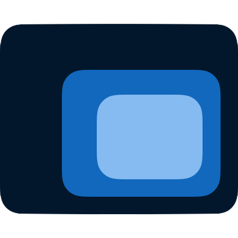

# **Capítulo V: Product Implementation, Validation & Deployment**
## 5.1. Software Configuration Management
### 5.1.1. Software Development Environment Configuration
En esta sección se describe las herramientas de software que utilizamos para colaborar en el ciclo de vida del proyecto de software.

**Project Management:**

- **Producto 1:** Whatsapp

  

- **Propósito:** Se utilizó WhatsApp como medio principal para la comunicación diaria entre los miembros del equipo. Su propósito fue facilitar el envío y recepción rápida de mensajes, coordinar actividades, y discutir avances o bloqueos en el desarrollo del proyecto, lo que optimizó la colaboración en tiempo real.
- **Ruta:** Este grupo es privado
- **Evidencia:**

  

---

- **Producto 2:** Discord

  

- **Propósito:** Se utilizó Discord para las reuniones y avances en tiempo real, aprovechando la funcionalidad de llamadas en canales de voz. Esto permitió una colaboración fluida, donde los miembros del equipo pudieron discutir y resolver problemas técnicos en tiempo real, optimizando la coordinación y el progreso del proyecto.
- **Ruta:** Este grupo es privado
- **Evidencia:**

  

---

- **Producto 3:** Trello

  

- **Propósito:** Se utilizó Trello para la asignación de tareas y el seguimiento del progreso de cada una. Esto facilitó la organización del trabajo del equipo, proporcionando una vista clara de las responsabilidades y el estado de cada tarea, lo que mejoró la planificación y la gestión del proyecto.
- **Ruta:** [Trello de Teemo Solutions](https://trello.com/invite/b/66e794edf4f9fedec2048599/ATTIfa1c3769a311557ffbe938d55599966c41049847/tb1-parcial)
- **Evidencia:**

  

**Requirement Management:**

- **Producto 1:** Miro

  

- **Propósito:** Se utilizó Miro para la elaboración de diagramas, permitiendo una colaboración visual en tiempo real entre los miembros del equipo.
- **Ruta:** [Miro de Teemo Solutions](https://miro.com/app/board/uXjVKYSGw5Y=/)
- **Evidencia:**

  

---

- **Producto 2:** UXPressia

  

- **Propósito:** Se utilizó UXPressia para la elaboración de mapas de empatía y user personas, permitiendo al equipo profundizar en la comprensión de las necesidades y comportamientos de los usuarios. Esta herramienta fue clave para definir los perfiles de usuario y crear experiencias más alineadas con sus expectativas y emociones.
- **Ruta:** Esta ruta no puede ser compartida a menos que se haya adquirido una suscripción.
- **Evidencia:**

  

---

- **Producto 3:** Structurizr

  

- **Propósito:** Se utilizó Structurizr para la creación de diagramas de componentes, contexto y contenedores. Esta herramienta ayudó al equipo a visualizar la arquitectura del sistema de manera clara y estructurada, facilitando la comprensión de cómo se interrelacionan los diferentes elementos del software y garantizando una planificación más eficiente.
- **Ruta:** [Structurizr de Teemo Solutions]()
- **Evidencia:**

  

**Product UX/UI Design:**

- **Producto 1:** Figma

  

- **Propósito:** Se utilizó Figma para la elaboración de wireframes y mockups, permitiendo la creación de prototipos visuales interactivos. Esta herramienta facilitó la colaboración en el diseño de la interfaz de usuario y ayudó al equipo a iterar rápidamente sobre diferentes ideas antes de pasar a la implementación.
- **Ruta:** [Figma de Teemo Solutions](https://www.figma.com/design/EYLzLCQ7Q0tj2w1ZfziK7D/TEEMO---FIGMA?node-id=0-1&t=iyhc8ybj8AX8zYjc-1)
- **Evidencia:**

  

---

- **Producto 2:** LucidChart

  

- **Propósito:** Se utilizó LucidChart para la creación de diagramas de clases y de base de datos, proporcionando una representación clara de la estructura del sistema. Esta herramienta facilitó la organización y planificación de la lógica de la aplicación, así como la estructura de almacenamiento de datos, asegurando que todos los elementos estuvieran correctamente interrelacionados.
- **Ruta:** [LucidChart de Teemo Solutions](https://lucid.app/lucidchart/5b93f4de-6135-4dcb-9f66-3f7f3fb2f005/edit?viewport_loc=-504%2C665%2C4992%2C2421%2C0_0&invitationId=inv_9f021ed4-6889-4f14-a487-05dd6b693eff")
- **Evidencia:**

  

**Software Development:**

- **Producto 1:** HTML

  

- **Propósito:** Se utilizó HTML como base para la estructura del contenido en el proyecto, permitiendo la creación de páginas web semánticas y accesibles. Esto facilitó la organización del contenido y garantizó que la interfaz de usuario estuviera bien estructurada, lo que contribuyó a una mejor experiencia de navegación

---

- **Producto 2:** CSS

  

- **Propósito:** Se utilizó CSS para el diseño y la presentación del proyecto, permitiendo la personalización del estilo visual y la responsividad de las páginas. Esto incluyó la definición de colores, tipografías, espaciados y animaciones, contribuyendo a una experiencia de usuario atractiva y coherente.

---

- **Producto 3:** JavaScript

  

- **Propósito:** Se utilizó JavaScript para añadir interactividad y funcionalidad dinámica al proyecto. Esto permitió la implementación de características como la validación de formularios, la manipulación del DOM y la gestión de eventos, mejorando la experiencia del usuario y la fluidez de la aplicación.

---

- **Producto 4:** WebStorm

  

- **Propósito:** Se utilizó WebStorm para la elaboración de la landing page, aprovechando sus características avanzadas de edición y herramientas integradas para facilitar el desarrollo. Esto permitió una gestión eficiente del código, la implementación de funcionalidades interactivas y la integración de estilos de manera organizada, contribuyendo a una presentación atractiva y profesional del proyecto.

---

- **Producto 5:** BootStrap

  

- **Propósito:** Se utilizó Bootstrap como framework CSS para agilizar el diseño y la maquetación de la landing page. Gracias a sus componentes y sistema de grid responsivo, se logró una interfaz coherente y adaptable a diferentes dispositivos, facilitando el desarrollo y asegurando una experiencia de usuario fluida.

---

- **Producto 6:** LineIcons

  

- **Propósito:** Se utilizó LineIcons para la incorporación de iconos en el diseño de la landing page. Esta biblioteca de iconos ligeros permitió enriquecer la interfaz visual, mejorando la comunicación de ideas y funciones a través de elementos gráficos claros y atractivos.

**Software Testing:**

- **Producto 1:** Lenguaje Gherkin

  

- **Propósito:** Se utilizó Gherkin como lenguaje de especificación para los testeos del proyecto, facilitando la redacción de pruebas de aceptación legibles y comprensibles tanto para desarrolladores como para partes interesadas no técnicas.

**Software Documentation:**

- **Producto 1:** GitHub

  

- **Propósito:** Se utilizó GitHub para el manejo del repositorio del proyecto, permitiendo un control de versiones efectivo y la colaboración entre los miembros del equipo. Esta plataforma facilitó el seguimiento de cambios, la gestión de ramas y la revisión de código, asegurando que el desarrollo se mantuviera organizado y documentado.
- **Ruta:** [GitHub de Teemo Solutions](https://github.com/Teemo-Solutions)

---

- **Producto 2:** Rider

  

- **Propósito:** Se utilizó Rider como entorno de desarrollo integrado (IDE) para el proyecto, proporcionando herramientas avanzadas para la edición de código, depuración y gestión de proyectos.

**Software Deployment:**

- **Producto 1:** GitHub Pages

  

- **Propósito:** Se utilizó GitHub Pages para el despliegue de la landing page, lo que permitió publicar la landing page de manera rápida y sencilla.
- **Ruta:** [Landing Page](https://teemo-solutions.github.io/Landing-Page_OpenSource/)

### 5.1.2. Source Code Management
- Landing Page Repository:

  

- **GitFlow Implementation:** Para implementar el flujo de trabajo Gitflow utilizando Git como nuestra herramienta de control de versiones, nos basamos en la entrada de blog "A successful Git branching model" de Vincent Driessen. Esta referencia nos permitió establecer las convenciones detalladas que serán aplicadas en nuestro proyecto

  

- **Master o Main branch:** La rama principal de desarrollo del proyecto es la Master branch. En esta rama reside el código que actualmente se encuentra en producción.

- **Develop branch:** La rama "Develop" albergará las más recientes actualizaciones y cambios agregados que serán incluidos en la próxima versión del proyecto. Esta rama sirve como un espacio para la integración y prueba continua de los cambios antes de ser fusionados con la rama principal "Master" para su despliegue en producción.

- **Release branch:** La rama de lanzamiento (Release branch) facilitará la preparación de una nueva versión del producto. Esta rama permitirá la corrección de errores y permitirá que la rama Develop reciba más actualizaciones.
 Debe derivarse de la rama Develop.
 Debe fusionarse con la rama Develop y Master.

- **Feature branch:** Las ramas de características (Feature branches) serán empleadas para desarrollar nuevas funcionalidades o características del producto que se agregarán en la siguiente versión o en versiones futuras. Estas funcionalidades deberán fusionarse eventualmente con la rama Develop.
 Debe derivarse de la rama Develop.
 Debe fusionarse de vuelta a la rama Develop.

- **Hotfix branch:** La rama de corrección rápida (Hotfix branch) se empleará para resolver y actuar de manera inmediata ante posibles errores en la versión en producción del producto. La característica principal de esta rama es que permite preparar una solución rápida mientras el resto del equipo continúa trabajando en otras funcionalidades o mejoras.
 Debe derivarse de la rama Master
 Debe fusionarse con la rama Develop y Master

- **Conventional Commits** Es una convención para estructurar los mensajes de confirmación (commits) en un formato estándar y semántico. Este formato ayuda a comunicar claramente los cambios realizados en el código y facilita la generación de registros de cambios automáticos. Los "Conventional Commits" suelen seguir un formato que incluye un encabezado, un cuerpo opcional y un pie de página opcional, y se utilizan para describir de manera sucinta y clara los cambios realizados en el código, lo que facilita su seguimiento y comprensión por parte de los desarrolladores y otros miembros del equipo.

La estructura de un commit debe seguir las siguientes pautas:
~~~
git commit -m “<type>[optional scope]: <title>“ -m “<description”
~~~

**Tipos De Conventional Commits**
~~~
1. feat: Se usa para describir una nueva característica o funcionalidad añadida al código.
2. fix: Indica una corrección de errores o solución a un problema.
3. docs: Se emplea para cambios o mejoras en la documentación del código.
4. style: Describe cambios relacionados con el formato del código, como espacios en blanco, sangrías, etc., que no afectan su funcionalidad.
5. refactor: Se utiliza para modificaciones en el código que no corrigen errores ni añaden nuevas funcionalidades, sino que mejoran su estructura o legibilidad.
6. test: Indica la adición o modificación de pruebas unitarias o funcionales.
7. chore: Se usa para cambios en el proceso de construcción o tareas de mantenimiento que no están directamente relacionadas con el código en sí.
8. perf: Describe mejoras de rendimiento en el código.
~~~

### 5.1.3. Source Code Style Guide & Conventions
    - **Single responsibility:**
      Cada clase o método debe tener una única función bien definida.
      ~~~ 
      // Clase responsable de manejar operaciones matemáticas básicas
      public class OperacionesMatematicas { 
          // Método para sumar dos números 
          public int Sumar(int a, int b) { 
              return a + b; 
          } 
       
          // Método para restar dos números 
          public int Restar(int a, int b) { 
              return a - b; 
          } 
      }
      ~~~
-  **LENGUAJE GHERKIN**
    - **Descriptive and concise titles for scenarios**
      Utilizar títulos descriptivos y concisos para los escenarios.
      ~~~ 
      Feature: Login
        Scenario: Successful login
          Given a user is on the login page     
          When they enter valid credentials     
          Then they should be logged in successfully      
      ~~~
    - **Follow the Given-When-Then structure consistently.**
      Seguir la estructura de Given-When-Then de manera consistente.
      ~~~ 
      Scenario: Adding items to the shopping cart
        Given the user is on the shopping page
        When they add an item to the cart
        Then the item should appear in the cart 
      ~~~
    - **Focus on business-readable language**
      Centrarse en un lenguaje legible para el negocio, evitando detalles técnicos de implementación.
      ~~~ 
      Scenario: Changing user settingst
        Given the user is logged in
        When they navigate to the settings page
        Then they should be able to update their profile
      ~~~
    - **Utilize Scenario Outline for scenarios with multiple similar cases.**
      Utilizar Scenario Outline para escenarios con múltiples casos similares.
      ~~~ 
      Scenario Outline: Searching for products
        Given the user is on the search page
        When they search for "<product>"
        Then they should see search results for "<product>"
      
      Examples:
        | product  |
        | Laptop   |
        | Smartphone |
      ~~~
    - **Add comments to provide additional context**
      Agregar comentarios para proporcionar contexto adicional o explicaciones cuando sea necesario.
      ~~~ 
      # This scenario checks the functionality of the logout feature
      Scenario: User logout
        Given the user is logged in
        When they click on the logout button
        Then they should be redirected to the login page      
      ~~~

### 5.1.4. Software Deployment Configuration
- **Creación y Deploy de la landing page**

1. Se crea un repositorio remoto en GitHub, se puede acceder por la siguiente ruta: [Repositorio de la Landing Page](https://github.com/Teemo-Solutions/Landing-Page_OpenSource.git)

  

2. Agregar a participantes

  

3. Habilitamos GitHub Pages en branch "master" y ruta "/(root)"

  

4. ya se puede visualizar la landing page en la siguiente ruta: [Landing Page](https://teemo-solutions.github.io/Landing-Page_OpenSource/)

  

## 5.2. Landing Page, Services & Applications Implementation
## 5.2.1. Sprint 1
## 5.2.1.1. Sprint Planning 1
Para este primer sprint nos enfocaremos en los tasks para la elaboración de la Landing Page. Nos dividiremos entre nosotros cada una de las tareas identificadas para el sprint.

<table>
<tr>
    <th colspan="5">Sprint #</th>
    <th colspan="9">Sprint 1</th>
  </tr>
      <tr>
    <td colspan="13">Sprint Planning Background</td>
  </tr>
  <tr>
    <td colspan="5">Date</td>
    <td colspan="8">2024-09-04</td>
</tr>
  <tr>
    <td colspan="5">Time</td>
    <td colspan="8">5:30 PM</td>
  </tr>
  <tr>
    <td colspan="5">Location</td>
    <td colspan="8">Via Discord</td>
<tr>
    <td colspan="5">Prepared By</td>
    <td colspan="8">Fernando Jesus</td>
</tr>
<tr>
    <td colspan="5">Attendees (to planning meeting)</td>
    <td colspan="8">Fernando, Andrés, José, Vicente y Yasser.
</td>
</tr>
<tr>
    <td colspan="5">Sprint n – 1 Review Summary</td>
    <td colspan="8">En esta primera sección se planteó el desarrollo de la Landing Page.</td>
</tr>
<tr>
    <td colspan="5">Sprint n – 1 Retrospective Summary</td>
    <td colspan="8">En esta sección todos los integrantes mencionaron tener aciertos en partes del código y en otras partes poder mejorar sus habilidades realizando la Landing Page</td>
</tr>
<tr>
    <td colspan="13">Sprint Goal & User Stories</td>
</tr>
<tr>
    <td colspan="5">Sprint n Goal</td>
    <td colspan="8">Finalizar con el desarrollo de la Landing Page</td>
</tr>
<tr>
    <td colspan="5">Sprint n Velocity</td>
    <td colspan="8">4 story points</td>
</tr>
<tr>
    <td colspan="5">Sum of Story Points</td>
    <td colspan="8">4 Story Points</td>
</tr>
</table>

## 5.2.1.2. Sprint Backlog 1

## 5.2.1.3. Development Evidence for Sprint Review

<table>
    <tr>
        <th colspan="2">Repository</th>
        <th colspan="2">Branch</th>
        <th colspan="2">Commit Id</th>
        <th colspan="2">Commit Message</th>
        <th colspan="2">Commit Message Body</th>
        <th colspan="2">Commited on (Date)</th>
    </tr>
    <tr>
        <td colspan="2">Teemo-Solutions/Landing-Page_OpenSource</td>
        <td colspan="2">Develop</td>
        <td colspan="2">87ed60f</td>
        <td colspan="2">Initial commit</td>
        <td colspan="2">-</td>
        <td colspan="2">03/09/2024</td>
    </tr>
    <tr>
        <td colspan="2">Teemo-Solutions/Landing-Page_OpenSource</td>
        <td colspan="2">Develop</td>
        <td colspan="2">2455ca5</td>
        <td colspan="2">feat: add index.html</td>
        <td colspan="2">-</td>
        <td colspan="2">03/09/2024</td>
    </tr>
    <tr>
        <td colspan="2">Teemo-Solutions/Landing-Page_OpenSource</td>
        <td colspan="2">Develop</td>
        <td colspan="2">267c9e5</td>
        <td colspan="2">feat(index.html): add vortex title</td>
        <td colspan="2">-</td>
        <td colspan="2">03/09/2024</td>
    </tr>
    <tr>
        <td colspan="2">Teemo-Solutions/Landing-Page_OpenSource</td>
        <td colspan="2">Develop</td>
        <td colspan="2">ad78499</td>
        <td colspan="2">feat: add vortex_icon.svg in to assets\images\logo</td>
        <td colspan="2">-</td>
        <td colspan="2">03/09/2024</td>
    </tr>
    <tr>
        <td colspan="2">Teemo-Solutions/Landing-Page_OpenSource</td>
        <td colspan="2">Develop</td>
        <td colspan="2">2872456</td>
        <td colspan="2">feat(index.html): add browser icon</td>
        <td colspan="2">-</td>
        <td colspan="2">03/09/2024</td>
    </tr>
    <tr>
        <td colspan="2">Teemo-Solutions/Landing-Page_OpenSource</td>
        <td colspan="2">Develop</td>
        <td colspan="2">1a751c6</td>
        <td colspan="2">feat(main.css): add new stylesheet main.css in to assets\css</td>
        <td colspan="2">-</td>
        <td colspan="2">03/09/2024</td>
    </tr>
    <tr>
        <td colspan="2">Teemo-Solutions/Landing-Page_OpenSource</td>
        <td colspan="2">Develop</td>
        <td colspan="2">5107208</td>
        <td colspan="2">feat(index.html): add preloader without functionality</td>
        <td colspan="2">-</td>
        <td colspan="2">03/09/2024</td>
    </tr>
    <tr>
        <td colspan="2">Teemo-Solutions/Landing-Page_OpenSource</td>
        <td colspan="2">Develop</td>
        <td colspan="2">ef423a7</td>
        <td colspan="2">feat: add logo.svg in to assets\images\logo</td>
        <td colspan="2">-</td>
        <td colspan="2">03/09/2024</td>
    </tr>
    <tr>
        <td colspan="2">Teemo-Solutions/Landing-Page_OpenSource</td>
        <td colspan="2">Develop</td>
        <td colspan="2">1ab18f5</td>
        <td colspan="2">feat: add white-logo.svg in to assets\images\logo</td>
        <td colspan="2">-</td>
        <td colspan="2">03/09/2024</td>
    </tr>
    <tr>
        <td colspan="2">Teemo-Solutions/Landing-Page_OpenSource</td>
        <td colspan="2">Develop</td>
        <td colspan="2">bc88b79</td>
        <td colspan="2">feat(index.html): add header and navbar without functionality and style</td>
        <td colspan="2">-</td>
        <td colspan="2">03/09/2024</td>
    </tr>
    <tr>
        <td colspan="2">Teemo-Solutions/Landing-Page_OpenSource</td>
        <td colspan="2">Develop</td>
        <td colspan="2">19bdfdc</td>
        <td colspan="2">docs(main.css): add index for the styles</td>
        <td colspan="2">-</td>
        <td colspan="2">03/09/2024</td>
    </tr>
</table>

## 5.2.1.4. Testing Suite Evidence for Sprint Review
## 5.2.1.5. Execution Evidence for Sprint Review
## 5.2.1.6. Services Documentation Evidence for Sprint Review
## 5.2.1.7. Software Deployment Evidence for Sprint Review
## 5.2.1.8. Team Collaboration Insights during Sprint
## 5.3. Validation Interviews
## 5.3.1. Diseño de Entrevistas
## 5.3.2. Registro de Entrevistas
## 5.3.3. Evaluaciones según heurísticas
## 5.4. Video About-the-Product

## Conclusiones
## Referencias bibliográficas
## Anexos